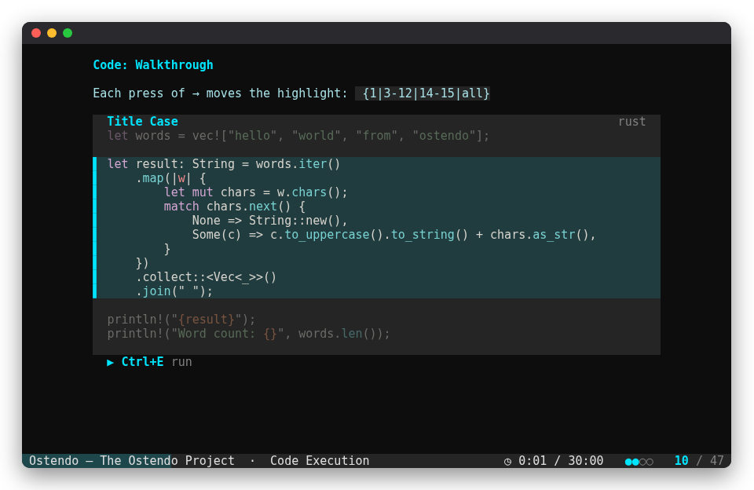
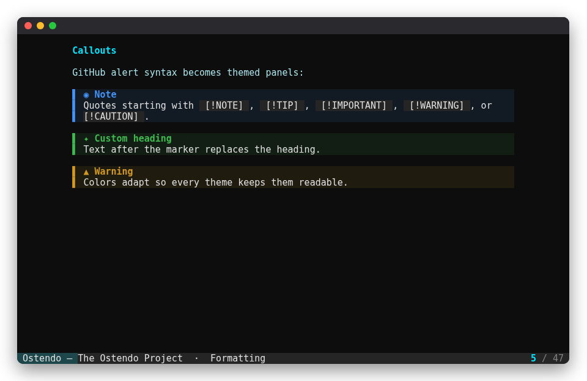
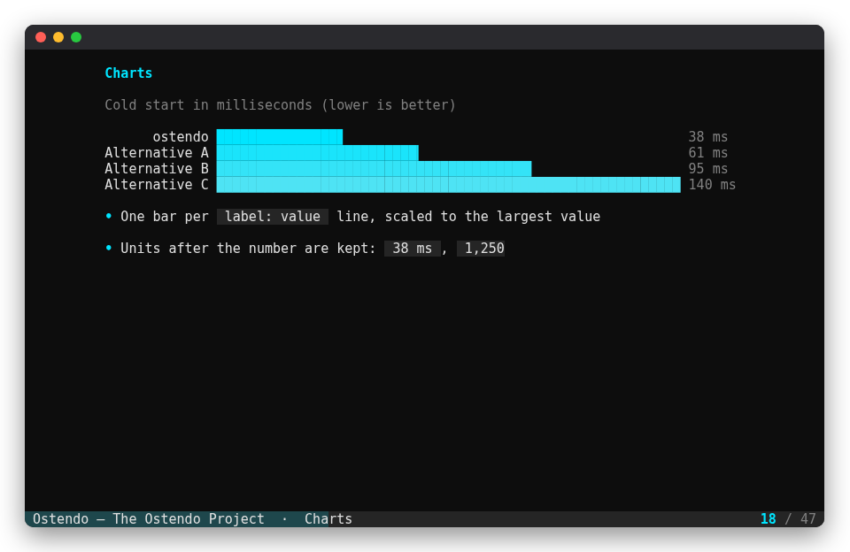

# Ostendo

*Latin: to show, to display.*

Markdown slides, presented in your terminal. Write a deck in any editor, run
it with one command, and present live code, images, diagrams, and speaker
notes without leaving the shell.


## Features

- **Plain markdown.** Slides are separated by `---`; directives are HTML
  comments, and GitHub callouts, task lists, links, and tables all work, so
  decks read just as well on GitHub.
- **Live code.** Run Python, Bash, JavaScript, Ruby, Rust, C, C++, or Go
  blocks with Ctrl+E and watch the output stream in, with colors. Walk
  through code one highlighted group of lines at a time.
- **Build slides step by step.** `<!-- pause -->` reveals a slide in parts;
  hidden parts keep their space, so nothing jumps.
- **Images everywhere.** Kitty, Ghostty, iTerm2, WezTerm, and Sixel graphics,
  true-color half blocks in every other terminal, and animated GIFs.
- **Math, charts, diagrams, and QR codes.** TeX math in Unicode, with stacked
  fractions, roots, and matrices; bar and column charts; arrow-syntax
  diagrams; Mermaid (with `mmdc`); and scannable QR codes.
- **Layout.** Columns, tables, callouts, FIGlet titles, footers, and per-slide
  themes, centered and wrapped to any terminal; images shrink so a slide fits.
- **Animations.** Fade, slide, and dissolve transitions; typewriter and fade-in
  entrances; matrix, sparkle, pulse, bounce, and spin loops.
- **Presenter tools.** Speaker notes, search, a blank screen, an overview, a
  timer that tracks your pace against the planned length, a phone remote
  that shows what comes next, and live audience polls voted from phones.
- **Authoring.** Hot reload jumps to the slide you just edited, and
  `--validate --size 100x30` names slides that would not fit.
- **Themes.** Every built-in theme passes WCAG contrast checks, with
  dark/light pairs you can switch on stage.
- **Fast.** Only the rows that change are redrawn, inside synchronized
  updates: no flicker, even over SSH and tmux.
- **Export and record.** Self-contained HTML, PDF through headless Chrome,
  editable PowerPoint with speaker notes, and asciinema recordings.

| | |
|:-:|:-:|
|  |  |
| Code walkthroughs | Callouts |
|  |  |
| Charts | Overview (`o`) |

## Install

```bash
cargo install --git https://github.com/ZoneMix/ostendo
```

Or build from a clone with `cargo build --release` (Rust 1.89 or newer).

## Quick start

```bash
ostendo presentations/examples/quick_start.md
```

A minimal deck:

````markdown
---
title: Shipping Rust
author: Ada Lovelace
theme: nord
transition: fade
---

# Shipping Rust
<!-- ascii_title -->
<!-- align: center -->

From prototype to production

---

# Why it works
<!-- section: Background -->

- Fearless refactoring
- One binary to deploy

```python +exec
print("hello from the slide")
```

<!-- notes: Ask who has shipped Rust before. -->
````

Run `ostendo --validate talk.md` before presenting. The full syntax is in
[docs/PRESENTATION_FORMAT.md](docs/PRESENTATION_FORMAT.md); every feature is
demonstrated in `presentations/examples/test_presentation.md`.

## Keys

| Key | Action |
|---|---|
| `→` `l` `Space` `Enter` `PgDn` | Next build step or slide |
| `←` `h` `Backspace` `PgUp` | Previous build step or slide |
| `Home` / `End` | First / last slide |
| `↓` `j` / `↑` `k` | Scroll the slide |
| `Ctrl+D` / `Ctrl+U` | Scroll half a page |
| `J` / `K` | Next / previous section |
| `g` then a number, `Enter` | Go to slide |
| `o` | Overview of all slides; `J` / `K` there move the selected slide (the file is rewritten) |
| `n` | Speaker notes (`N` / `P` scroll them) |
| `m` / `{` / `}` | Notes beside or below the slide; make them smaller or larger (remembered) |
| `/` | Search slide text and notes (`/` then Enter: next match) |
| `b` | Blank the screen (any key brings it back) |
| `e` | Edit this slide in `$VISUAL` / `$EDITOR`, then come back to it |
| `Ctrl+E` | Run the code block (again: next block) |
| `1`–`9` | Add a vote to that option of the poll on screen (a show of hands) |
| `f` | Hide the status bar |
| `t` | Start / reset the timer (it starts at the first slide change) |
| `T` | Show the theme name |
| `S` | Section labels above titles |
| `D` | Switch between a theme's dark and light versions |
| `+` / `-` | Content width |
| `>` / `<` | Image size |
| `]` / `[` / `0` | Font size up / down / reset (Kitty, Ghostty) |
| `:` | Command: `theme <slug>`, `goto <n>`, `timer reset`, `notes`, `overview`, `reload`, `q` |
| `?` | Help |
| `q` / `Ctrl+C` | Quit |

Ostendo remembers the slide, theme, and font adjustments for each
presentation. Every run of a minute or more with the timer going is kept, and
`ostendo talk.md --report` shows where the time went:

```text
3 run(s); latest 2026-09-27, 21:40 of 20:00 planned

    #  Slide                  Latest  Average     Plan
    1  Why terminals             1:05     0:50     2:00
    2  The render loop           6:20     4:10     2:00  +4:20
```

## Command line

| Option | Effect |
|---|---|
| `-t, --theme <slug>` | Theme (overrides the front matter) |
| `-s, --slide <n>` | Start on slide *n* (default: where you left off) |
| `--image-mode <mode>` | `auto`, `kitty`, `iterm`, `sixel`, `blocks`, `ascii` |
| `--scale <percent>` | Content width, 40–100 (default 80) |
| `--fullscreen` | Start without the status bar |
| `--timer` | Start the timer immediately |
| `--no-exec` | Never run code blocks |
| `--remote` | Serve a remote control page on `127.0.0.1` |
| `--remote-port <port>` | Remote port (default 8765) |
| `--remote-token <token>` | Require a token for the remote |
| `--remote-exec` | Let the remote run code blocks |
| `--audience` | Serve a voting page for poll slides to your network |
| `--audience-port <port>` | Voting page port (default 8766) |
| `--validate` | Check the deck and exit |
| `--size <cols>x<rows>` | With `--validate`: also report slides that would scroll at that size |
| `--record <file>` | Record the talk as an asciicast ([asciinema](https://asciinema.org)) |
| `--export html\|pdf\|pptx` | Export and exit (`-o` sets the path) |
| `--list-themes` | List themes with swatches |
| `--report` | Time per slide in past runs against the average and the plan |
| `--count`, `--export-titles` | Print the slide count or titles |
| `--detect-protocol` | Print the image protocol for this terminal |

## Terminals

| | Kitty | Ghostty | iTerm2 / WezTerm | Others |
|---|:-:|:-:|:-:|:-:|
| Images | Kitty graphics | Kitty graphics | Inline images | Half blocks (Sixel with `--image-mode sixel`) |
| Per-slide font size | Yes¹ | macOS² | – | – |
| Large titles (`text_scale`) | Yes | – | – | – |

1. Needs `allow_remote_control yes` in `kitty.conf`.
2. Sends Ghostty's zoom shortcuts; macOS asks for Accessibility permission
   the first time.

Inside tmux, Kitty and Ghostty images fall back to half blocks and font sizing
is off; iTerm2 images still work.

## Themes

`ostendo --list-themes` shows them all. Choose one with `--theme`, `theme:` in
the front matter, or `:theme <slug>` while presenting. To make your own, see
[docs/THEME_GUIDE.md](docs/THEME_GUIDE.md).

## Remote control

```bash
ostendo talk.md --remote --remote-token "$(openssl rand -hex 16)"
```

Open the printed URL for a presenter view: the current slide, its notes,
what comes next, the timer and pace, and buttons to navigate or blank the
screen. It listens on `127.0.0.1` only; forward the port (for example
with `ssh -L`) to use it from a phone. See [SECURITY.md](SECURITY.md) before
presenting decks you did not write.

## Audience polls

```bash
ostendo talk.md --audience
```

A ```` ```poll ```` slide shows its options as live bars and, with
`--audience`, a QR code for a voting page that everyone on the same network
can open. Votes arrive as they are cast; `1`–`9` add votes by hand. The page
shows only the poll on screen: it cannot move slides or see your notes.

## Export and record

```bash
ostendo talk.md --export html            # talk.html, images embedded
ostendo talk.md --export pdf -o talk.pdf # needs Chrome/Chromium or wkhtmltopdf
ostendo talk.md --export pptx            # PowerPoint, Keynote, Google Slides
ostendo talk.md --record talk.cast       # then: asciinema play talk.cast
```

Recordings draw images as half blocks unless `--image-mode` says otherwise,
so they replay anywhere.

## Contributing

See [CONTRIBUTING.md](CONTRIBUTING.md).

## License

[GPL-3.0-only](LICENSE)
