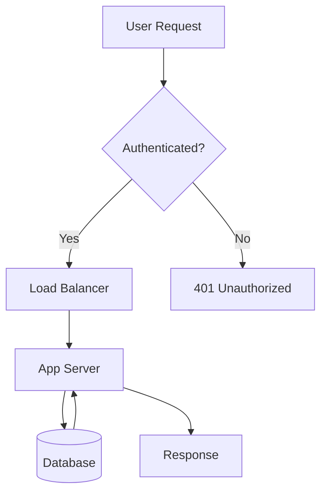

# Ostendo
<!-- section: Introduction -->
<!-- ascii_title -->
<!-- font_size: 6 -->
<!-- loop_animation: sparkle(figlet) -->

Terminal presentations, reimagined.

- Markdown-native slide decks rendered in your terminal
- 29 themes, live code execution, animations, and more
- Built in Rust for speed and reliability

<!-- notes:
Welcome to Ostendo. This presentation is itself a live demo of every major feature.
Press 'n' to toggle speaker notes. Press '?' to see all keyboard shortcuts.
Press Ctrl+E on executable code blocks to run them live.
-->

---

# What is Ostendo?
<!-- section: Introduction -->
<!-- title_decoration: underline -->
<!-- font_size: 4 -->
<!-- animation: fade_in -->

A **Rust-powered** presentation engine that renders *beautiful slide decks* directly in your terminal.

- **Markdown-native** -- write slides in plain text with `---` separators
- *29 built-in themes* with live switching via `:theme slug`
- Executable code blocks in `Python`, `Rust`, `Go`, `C`, `C++`, `Ruby`, `Bash`, and `JavaScript`
- ~~PowerPoint~~ -- no GUI dependencies, no browser, no Electron
- Image rendering: Kitty, iTerm2, Sixel, and ASCII fallback
- Column layouts, tables, diagrams, and block quotes
- Speaker notes, pace tracking, and WebSocket remote control

> Everything you see is rendered in the terminal. It works over SSH, in tmux, and in containers.

<!-- notes:
Ostendo replaces GUI presentation tools with a terminal-native experience.
The entire rendering pipeline uses a virtual buffer that is flushed in a single
synchronized update to eliminate flicker. No curses library needed.
-->

---

# Rich Markdown Formatting
<!-- section: Formatting -->
<!-- title_decoration: box -->
<!-- font_size: 4 -->
<!-- animation: fade_in -->

All standard inline formatting works everywhere -- bullets, subtitles, and block quotes:

- **Bold text** for emphasis and key terms
- *Italic text* for nuance and attribution
- `inline code` with a highlighted background
- ~~Strikethrough~~ for corrections and comparisons
- **Bold with `code` inside** and *italic with ~~struck~~ words*
- Nested bullets with depth:
  - Second level for details
    - Third level for specifics

> Formatting also works inside block quotes: **bold**, *italic*, `code`, and ~~strike~~

<!-- notes:
Ostendo parses all standard Markdown inline formatting. The rendering engine
applies ANSI escape codes to produce bold, italic, dim (strikethrough), and
background-highlighted (code) spans in any terminal that supports SGR sequences.
-->

---

# Block Quotes and Attribution
<!-- section: Formatting -->
<!-- font_size: 4 -->

Callouts, quotations, and emphasis blocks:

> "The best way to predict the future is to invent it."
> -- Alan Kay

> "Any sufficiently advanced technology is indistinguishable from magic."
> -- Arthur C. Clarke

> "Simplicity is prerequisite for reliability."
> -- Edsger W. Dijkstra

- Block quotes render with an accent-colored vertical bar
- Support all inline formatting inside the quote
- Multiple quotes per slide are allowed

<!-- notes:
Block quotes are rendered with the theme's accent color as a left border bar.
They're useful for callouts, warnings, and attributions. Each contiguous block
of '>' lines becomes a separate BlockQuote element.
-->

---

# Data Tables
<!-- section: Formatting -->
<!-- font_size: 4 -->

Standard Markdown pipe tables with column alignment:

| Feature          | Languages | Since   |
|:-----------------|:---------:|--------:|
| Syntax highlight | 30+       | v0.1.0  |
| Code execution   | 8         | v0.2.0  |
| Auto-wrap exec   | Rust/Go/C | v0.2.0  |
| Preamble inject  | All       | v0.2.0  |
| PTY mode         | Bash      | v0.2.1  |

- Left-align with `:---`, center with `:---:`, right with `---:`
- Tables render with box-drawing borders and themed colors

<!-- notes:
Tables use the standard Markdown pipe syntax. The alignment of each column is
determined by colon placement in the separator row. The renderer draws
Unicode box-drawing characters for clean borders.
-->

---

# Code: Python
<!-- section: Code Execution -->
<!-- title_decoration: banner -->
<!-- font_size: 4 -->
<!-- animation: fade_in -->

Mark code blocks with `+exec` and press **Ctrl+E** to execute live:

```python +exec {label: "Fibonacci Generator"}
def fibonacci(n):
    """Generate the first n Fibonacci numbers."""
    a, b = 0, 1
    sequence = []
    for _ in range(n):
        sequence.append(a)
        a, b = b, a + b
    return sequence

fibs = fibonacci(15)
print("Fibonacci:", fibs)
print(f"Sum: {sum(fibs)}")
print(f"Ratio F14/F13: {fibs[14]/fibs[13]:.6f}")
```

<!-- notes:
Press Ctrl+E to run this code block. Output streams below the code in real time.
The ratio of consecutive Fibonacci numbers converges to the golden ratio (1.618034).
The +exec badge appears in the top-right corner of the code block.
-->

---

# Code: Rust (Auto-Wrap)
<!-- section: Code Execution -->
<!-- font_size: 4 -->
<!-- font_transition: none -->

No `fn main()` needed -- Ostendo auto-wraps bare Rust code:

```rust +exec {label: "Iterator Chains"}
let words = vec!["hello", "world", "from", "ostendo"];

let result: String = words.iter()
    .map(|w| {
        let mut chars = w.chars();
        match chars.next() {
            None => String::new(),
            Some(c) => c.to_uppercase().to_string() + chars.as_str(),
        }
    })
    .collect::<Vec<_>>()
    .join(" ");

println!("{result}");
println!("Word count: {}", words.len());
```

- Helper functions are extracted automatically before `main()`
- Also works for Go and C

<!-- notes:
Ostendo detects when Rust code lacks a fn main() and automatically wraps it.
Any standalone function definitions are extracted and placed before main().
This lets you write concise code examples without boilerplate.
-->

---

# Multi-Language Columns
<!-- section: Code Execution -->
<!-- font_size: 4 -->
<!-- font_transition: none -->

<!-- column_layout: [1, 1] -->
<!-- column: 0 -->

```go +exec {label: "primes.go"}
for i := 2; i <= 30; i++ {
    prime := true
    for j := 2; j*j <= i; j++ {
        if i%j == 0 {
            prime = false
            break
        }
    }
    if prime {
        fmt.Printf("%d ", i)
    }
}
fmt.Println()
```

<!-- column: 1 -->

```ruby +exec {label: "stats.rb"}
data = [23, 45, 12, 67, 34, 89, 56]
sorted = data.sort
mean = data.sum.to_f / data.size
median = sorted[sorted.size / 2]

puts "Data:   #{data.inspect}"
puts "Sorted: #{sorted.inspect}"
puts "Mean:   #{mean.round(1)}"
puts "Median: #{median}"
puts "Range:  #{sorted.last - sorted.first}"
```

<!-- reset_layout -->

<!-- notes:
Both columns contain executable code blocks. Press Ctrl+E to cycle through them.
Go code is auto-wrapped (no package main / func main needed).
The +exec badge appears on each block to indicate it's runnable.
-->

---

# Code Preambles
<!-- section: Code Execution -->
<!-- font_size: 4 -->
<!-- animation: fade_in -->

Hidden imports injected before execution with `preamble_start`/`preamble_end`:

<!-- preamble_start: python -->
import math
import random
random.seed(42)
<!-- preamble_end -->

```python +exec {label: "Math with Hidden Imports"}
# math and random are available via hidden preamble
angle_deg = 45
angle_rad = math.radians(angle_deg)

print(f"sin({angle_deg}) = {math.sin(angle_rad):.4f}")
print(f"cos({angle_deg}) = {math.cos(angle_rad):.4f}")
print(f"Random sample: {[random.randint(1, 100) for _ in range(5)]}")
```

- Preamble code is invisible on the slide but prepended at execution time
- Useful for setup code, imports, and shared utilities

<!-- notes:
The preamble_start/preamble_end directives define hidden code that is prepended
to executable blocks of the matching language. The preamble does not appear
on the slide but is included when Ctrl+E runs the code. Here, math and random
are imported silently so the visible code stays focused on the interesting parts.
-->

---

# Column Layouts
<!-- section: Layouts -->
<!-- title_decoration: banner -->
<!-- font_size: 4 -->

<!-- column_layout: [1, 1, 1] -->
<!-- column: 0 -->

**Design**

- Markdown-native
- YAML themes
- Hot reload
- 200ms render

<!-- column: 1 -->

**Render**

- Virtual buffer
- Sync updates
- Image caching
- Smart redraw

<!-- column: 2 -->

**Present**

- Speaker notes
- Pace timer
- Remote control
- Section nav

<!-- reset_layout -->

> Three equal columns with `column_layout: [1, 1, 1]`

<!-- notes:
Column layouts accept any number of columns with relative width ratios.
Content inside each column supports bullets, code blocks, and text.
The ratios determine proportional width allocation (e.g., [2, 1] gives
the left column twice the width of the right).
-->

---

# Weighted Columns
<!-- section: Layouts -->
<!-- font_size: 4 -->
<!-- font_transition: none -->

Asymmetric layouts with `column_layout: [2, 1]`:

<!-- column_layout: [2, 1] -->
<!-- column: 0 -->

**Vulnerable Pattern**

```python {label: "sql_injection.py"}
# NEVER do this
query = f"SELECT * FROM users WHERE id = {user_id}"
cursor.execute(query)
```

**Secure Pattern**

```python {label: "parameterized.py"}
# Always use parameterized queries
query = "SELECT * FROM users WHERE id = %s"
cursor.execute(query, (user_id,))
```

<!-- column: 1 -->

**Why it matters**

- SQL injection remains a top-10 vulnerability
- Parameterized queries prevent injection by design
- The fix is always simpler than the exploit

<!-- reset_layout -->

<!-- notes:
Weighted columns are ideal for code comparisons with commentary.
The wider column holds the code examples while the narrower sidebar
provides context. The ratio [2, 1] gives 2/3 width to the left column.
-->

---

# Images: Protocol Auto-Detection
<!-- section: Images -->
<!-- title_decoration: underline -->
<!-- image_scale: 50 -->
<!-- font_size: 4 -->
<!-- animation: fade_in -->

Ostendo detects the best image protocol for your terminal:


- **Kitty**: Native graphics protocol (best quality)
- **iTerm2**: Inline image protocol
- **Sixel**: Bitmap protocol (wide support)
- **ASCII**: Universal text fallback

<!-- notes:
The image renderer probes the terminal at startup to determine which image
protocol is available. Kitty's native protocol provides the highest quality.
Scale with > and < keys during presentation. The image_scale directive
sets the initial size as a percentage of terminal width.
-->

---

# Images: ASCII Art Mode
<!-- section: Images -->
<!-- image_render: ascii -->
<!-- image_color: #00FF88 -->
<!-- image_scale: 45 -->
<!-- font_size: 4 -->
<!-- font_transition: none -->

Force ASCII rendering with custom color override:


- Set via `<!-- image_render: ascii -->`
- Color override via `<!-- image_color: #00FF88 -->`
- Works in every terminal, even over serial connections

<!-- notes:
ASCII art mode maps pixel brightness to a character ramp. The image_color
directive overrides the default color with a custom hex value, applying it
uniformly to all characters. This mode works everywhere including plain
text terminals and serial consoles.
-->

---

# Animated GIFs
<!-- section: Images -->
<!-- align: center -->
<!-- image_scale: 60 -->
<!-- font_size: 4 -->
<!-- font_transition: none -->


Animated GIF support with background frame decoding

- Frames decoded asynchronously and downscaled to 800px max
- Playback synchronized within terminal update blocks

<!-- notes:
Animated GIFs are decoded in a background thread. Each frame is rendered
using the terminal's best available image protocol. The downscaling to 800px
max dimension keeps memory usage reasonable for large GIFs. Frame advancement
happens within synchronized update blocks to prevent flicker.
-->

---

# Diagram: Box Style
<!-- section: Diagrams -->
<!-- title_decoration: banner -->
<!-- font_size: 4 -->
<!-- font_transition: none -->

Native ASCII diagrams with the built-in diagram engine (no external tools):

```diagram
# HTTP Request Lifecycle
Request -> Auth -> Validate -> Process -> Response
: incoming : JWT verify : schema check : business logic : JSON payload
```

- Default box style with Unicode borders
- Annotations appear below each node
- Title rendered above the flow

<!-- notes:
The built-in diagram engine renders ASCII box diagrams without requiring
any external CLI tool. The DSL uses 'Node -> Node' syntax for flows,
'# Title' for diagram titles, and ': annotation' lines for node descriptions.
Box style is the default and uses Unicode box-drawing characters.
-->

---

# Diagram: Bracket Style
<!-- section: Diagrams -->
<!-- font_size: 4 -->

Compact bracket notation for tighter layouts:

```diagram style=bracket
# CI/CD Pipeline
Commit -> Build -> Test -> Deploy -> Monitor
: git push : cargo build : cargo test : k8s rollout : prometheus
```

- Set via `` ```diagram style=bracket ``
- Renders nodes with `[square brackets]`
- More compact than box style

<!-- notes:
Bracket style uses square brackets instead of box-drawing characters,
producing a more compact diagram. This style works well when terminal
width is limited or when you want a lighter visual weight.
-->

---

# Diagram: Vertical Flow
<!-- section: Diagrams -->
<!-- font_size: 4 -->
<!-- animation: fade_in -->

Top-to-bottom layout for hierarchical flows:

```diagram style=vertical
# Error Handling
Parse Input -> Validate Schema -> Execute Query -> Format Response
: serde_json : jsonschema : sqlx : serde
```

- Set via `` ```diagram style=vertical ``
- Nodes flow from top to bottom
- Ideal for pipeline and waterfall diagrams

<!-- notes:
Vertical style arranges nodes from top to bottom instead of left to right.
This orientation is natural for pipeline diagrams, decision trees, and
any flow that represents progression through stages.
-->

---

# Transition: Fade
<!-- section: Animations -->
<!-- title_decoration: banner -->
<!-- transition: fade -->
<!-- font_size: 6 -->

This slide uses `<!-- transition: fade -->`.

- Content fades out when leaving this slide
- The next slide fades in smoothly
- Navigate forward to see the effect

> Transitions are set per-slide and play when navigating away

<!-- notes:
The fade transition gradually dims the current slide content to blank,
then brightens the new slide content from blank. It creates a smooth
cinematic feel between slides. Set via the transition directive.
-->

---

# Transition: Dissolve
<!-- section: Animations -->
<!-- transition: dissolve -->
<!-- font_size: 6 -->

This slide uses `<!-- transition: dissolve -->`.

- Characters scatter into random symbols when leaving
- Per-character jumbling creates a pixelated dissolve effect
- Navigate forward to see it in action

> Each character independently transitions through random glyphs

<!-- notes:
The dissolve transition replaces each character with a random symbol
before clearing the screen. This creates a unique per-character scatter
effect that feels organic and visually striking. The randomization
happens on every frame during the transition duration.
-->

---

# Transition: Slide
<!-- section: Animations -->
<!-- transition: slide -->
<!-- font_size: 6 -->

This slide uses `<!-- transition: slide -->`.

- Content slides horizontally off-screen when navigating
- New content slides in from the opposite direction
- Creates a physical motion effect

> The slide direction matches the navigation direction

<!-- notes:
The slide transition moves content horizontally, similar to a card deck.
When navigating forward, content slides left and new content enters from
the right. When navigating backward, the directions reverse. This is the
most traditional presentation transition style.
-->

---

# Entrance: Typewriter
<!-- section: Animations -->
<!-- animation: typewriter -->
<!-- font_size: 6 -->

Characters appear one at a time, creating a typing effect:

- Each line reveals character by character
- Creates suspense and draws attention to content
- Works with all content types: bullets, code, quotes

> The typewriter effect is set via `<!-- animation: typewriter -->`

<!-- notes:
The typewriter entrance animation reveals content character by character
from left to right, top to bottom. It plays once when the slide first
appears and does not repeat. The speed is calibrated to be readable
without feeling slow. Entrance animations are one-shot effects.
-->

---

# Entrance: Fade In
<!-- section: Animations -->
<!-- animation: fade_in -->
<!-- font_size: 6 -->

Content brightens from dim to full opacity:

- Smooth brightness transition on all content
- Professional reveal effect
- Plays once on slide entry

> A subtle, elegant way to reveal slide content

<!-- notes:
The fade_in entrance animation starts with all content at minimum brightness
and gradually increases to full brightness. It's the most subtle entrance
effect and works well for professional presentations where you want
polish without distraction.
-->

---

# Loop: Matrix Rain
<!-- section: Animations -->
<!-- loop_animation: matrix -->
<!-- font_size: 6 -->

The Matrix has you...

- Green cascading characters fill the screen
- Content remains readable beneath the rain
- Continuous animation that never stops

<!-- notes:
The matrix rain loop animation fills the screen with cascading green
characters that fall from top to bottom. The rain uses random ASCII
characters and fills whitespace areas including FIGlet letter gaps.
This is a continuous animation that runs as long as the slide is displayed.
-->

---

# Loop: Sparkle on FIGlet
<!-- section: Animations -->
<!-- ascii_title -->
<!-- font_size: 2 -->
<!-- loop_animation: sparkle(figlet) -->
<!-- font_transition: none -->

Twinkling stars on the ASCII art title above

- Targeted via `sparkle(figlet)` -- only affects the FIGlet text
- Stars twinkle randomly across the title characters
- Other content remains static

<!-- notes:
The sparkle animation can be targeted to specific content types using
parenthetical syntax. sparkle(figlet) restricts the twinkling stars to
only the FIGlet ASCII art title, leaving bullets and other content
untouched. Other targets include sparkle(image) for ASCII art images.
-->

---

# Loop: Bounce
<!-- section: Animations -->
<!-- loop_animation: bounce -->
<!-- font_size: 6 -->

A bouncing ball traverses the entire screen:

- Ball overlays all content as it moves
- Bounces off screen edges at angles
- Full-width animation covering the entire viewport

<!-- notes:
The bounce animation draws a ball character that moves diagonally across
the screen, bouncing off the edges. The ball overlays all content and
uses the theme's accent color. The animation covers the full terminal
width and height for maximum visual impact.
-->

---

# Loop: Pulse
<!-- section: Animations -->
<!-- loop_animation: pulse -->
<!-- font_size: 6 -->

All content rhythmically fades in and out:

- Smooth sinusoidal brightness oscillation
- Every element on the slide pulses together
- Creates a breathing or heartbeat effect

> Watch the brightness cycle smoothly between dim and bright

<!-- notes:
The pulse animation modulates the brightness of all content on a
sinusoidal curve, creating a smooth breathing effect. The cycle time
is approximately 2 seconds. This is useful for emphasis slides or
attention-grabbing title cards.
-->

---

# Loop: Spin on FIGlet
<!-- section: Animations -->
<!-- ascii_title -->
<!-- font_size: 0 -->
<!-- loop_animation: spin(figlet) -->
<!-- font_transition: none -->

Characters cycle through the ASCII density ramp

- Each character rotates through: ` .:-=+*#%@`
- Creates a shimmering, evolving texture
- Targeted to FIGlet title only via `spin(figlet)`

<!-- notes:
The spin animation cycles each character through an ASCII density ramp,
creating a shimmering effect where the visual weight of characters
constantly shifts. When targeted to FIGlet text, the large ASCII art
title appears to shimmer and evolve continuously.
-->

---

# Font Sizing: Large
<!-- section: Display -->
<!-- title_decoration: banner -->
<!-- font_size: 7 -->

This slide uses `<!-- font_size: 7 -->` for maximum readability.

- Font size range: -3 to 7
- Requires Kitty or Ghostty terminal
- Gracefully ignored on other terminals

> Large font is ideal for keynote-style title cards and audience-facing content

<!-- notes:
Font sizing uses the Kitty terminal's remote control protocol to change
the terminal font size. The range extends from -3 (smaller than base) to 7
(much larger). By default, font size changes include a dissolve transition
animation. Use font_transition: none for instant changes.
-->

---

# Font Sizing: Small Detail
<!-- section: Display -->
<!-- font_size: 3 -->
<!-- font_transition: none -->

This slide uses `<!-- font_size: 3 -->` with `<!-- font_transition: none -->` for instant change.

- Negative font sizes shrink below the terminal's base size
- Perfect for dense content, code listings, and data tables
- `font_transition: none` skips the dissolve animation

| Terminal     | Font Sizing | Image Protocol | Best For        |
|:-------------|:-----------:|:--------------:|:----------------|
| Kitty        | Full        | Native         | Development     |
| Ghostty      | Full        | Kitty          | Development     |
| iTerm2       | None        | Inline         | macOS users     |
| WezTerm      | None        | Sixel          | Cross-platform  |
| Any terminal | None        | ASCII          | Remote/SSH      |

<!-- notes:
Small font sizes are useful for slides with dense content like tables
or code listings. The font_transition: none directive makes the size
change instant instead of using the default dissolve animation.
This avoids the brief blank screen during font transitions.
-->

---

# Per-Slide Theme Override
<!-- section: Display -->
<!-- theme: dracula -->
<!-- font_size: 4 -->

This slide uses `<!-- theme: dracula -->` to override the presentation theme.

- Each slide can specify its own theme
- Returns to the global theme on the next slide
- All 29 themes are available as overrides

| Theme Slug       | Style              |
|:-----------------|:-------------------|
| `dracula`        | Developer classic  |
| `nord`           | Calm, professional |
| `terminal_green` | Hacker aesthetic   |
| `outrun`         | Retro synthwave    |
| `catppuccin`     | Modern pastel      |
| `matrix`         | Maximum hacker     |
| `clean_light`    | Bright rooms       |

<!-- notes:
Per-slide theme overrides let you switch visual styles for emphasis or
variety without changing the global theme. The override only applies to
the current slide. Press K to cycle through all themes globally,
or use :theme slug in command mode.
-->

---

# Title Decorations
<!-- section: Display -->
<!-- font_size: 6 -->

Three decoration styles for slide titles:

<!-- column_layout: [1, 1, 1] -->
<!-- column: 0 -->

**Underline**

`title_decoration: underline`

A clean accent-colored line beneath the title

<!-- column: 1 -->

**Box**

`title_decoration: box`

Full border with box-drawing characters around the title

<!-- column: 2 -->

**Banner**

`title_decoration: banner`

Full-width accent background behind the title text

<!-- reset_layout -->

> Set per-slide via directive, or globally in the theme YAML

<!-- notes:
Title decorations add visual emphasis to slide headings. The underline
style draws a horizontal line in the accent color below the title.
The box style wraps the title in a Unicode box border. The banner style
fills the entire title row with the accent color as background.
Each slide in this demo uses different decorations for variety.
-->

---

# Fullscreen Mode
<!-- section: Display -->
<!-- fullscreen -->
<!-- align: center -->
<!-- font_size: 6 -->

This slide uses `<!-- fullscreen -->` -- no status bar, no progress bar.

Press **f** to toggle fullscreen on any slide.

> Clean, distraction-free presentation

<!-- notes:
Fullscreen mode hides the status bar and progress bar, giving the content
the full terminal height. It can be set per-slide with the fullscreen
directive or toggled at any time with the 'f' key. The user toggle
is sticky until the next slide is reached.
-->

---

# Footer Bar
<!-- section: Display -->
<!-- footer: Ostendo Demo | March 2026 | Slide 32/37 -->
<!-- footer_align: center -->
<!-- font_size: 6 -->

Per-slide footer displayed at the bottom of the screen:

- Set text with `<!-- footer: Your text here -->`
- Align with `<!-- footer_align: left|center|right -->`
- Independent of the top status bar

> Look at the bottom of this slide for the footer

<!-- notes:
The per-slide footer bar appears at the very bottom of the terminal,
below all content. It is separate from the top status bar and can be
customized per-slide. Footer alignment defaults to left but can be
set to center or right via the footer_align directive.
-->

---

# Sections and Navigation
<!-- section: Navigation -->
<!-- title_decoration: banner -->
<!-- show_section: true -->
<!-- font_size: 4 -->

Slides are grouped into sections with `<!-- section: Name -->`:

- **Shift+Right** / **Shift+Left**: Jump to next/previous section
- **J** / **K**: Also jump between sections
- Section name visible in the status bar (toggle with **s**)
- This presentation has sections: Introduction, Formatting, Code Execution, Layouts, Images, Diagrams, Animations, Display, Navigation, Advanced, Closing

> Sections make large presentations navigable

<!-- notes:
Sections provide logical grouping for slides. The section directive
sets the section name that appears in the status bar. Section navigation
keys (Shift+arrows or J/K) skip directly to the first slide of the
next or previous section, making it easy to jump between topics.
-->

---

# Mermaid Diagrams
<!-- section: Advanced -->
<!-- title_decoration: underline -->
<!-- font_size: 4 -->

External diagram rendering via the `mmdc` CLI (requires Mermaid CLI installed):



- Rendered as an image using the terminal's image protocol
- Supports flowcharts, sequence diagrams, and more

<!-- notes:
Mermaid diagrams require the mmdc CLI tool to be installed (npm install -g @mermaid-js/mermaid-cli).
The diagram source is rendered to a PNG image which is then displayed using
the terminal's best available image protocol. If mmdc is not available,
the raw source text is shown instead.
-->

---

# Remote Control
<!-- section: Advanced -->
<!-- font_size: 3 -->

Present from one machine, control from another:

```bash
# Start with remote control enabled
ostendo presentation.md --remote

# With authentication token
ostendo presentation.md --remote --remote-token SECRET
```

- WebSocket server on port 9090
- Web UI at `http://127.0.0.1:9090`
- Full control: navigation, theme switching, code execution
- Speaker notes visible in the remote UI
- Token-based authentication for security

> Perfect for presenting on a projector while controlling from your phone

<!-- notes:
The --remote flag starts a WebSocket server alongside the presentation.
Any web browser can connect to the control UI for navigation, theme
switching, and viewing speaker notes. The --remote-token flag adds
authentication. Use --remote-exec to allow code execution from the remote
(disabled by default for security). The --no-exec flag disables all
code execution entirely.
-->

---

# Keyboard Reference
<!-- section: Navigation -->
<!-- font_size: 3 -->

<!-- column_layout: [1, 1] -->
<!-- column: 0 -->

**Navigation**
- `h`/`l` or arrows: prev/next slide
- `j`/`k`: scroll content up/down
- `J`/`K` or Shift+arrows: section jump
- `g` + number + Enter: go to slide N
- `Ctrl+D`/`Ctrl+U`: half-page scroll
- `o`: slide overview grid

<!-- column: 1 -->

**Actions**
- `?`: help overlay
- `n`: toggle speaker notes
- `f`: toggle fullscreen
- `Ctrl+E`: execute code block
- `+`/`-`: scale content width
- `]`/`[`: increase/decrease font
- `>`/`<`: image scale up/down
- `D`: toggle dark/light theme
- `:`: command mode

<!-- reset_layout -->

> Press `?` during any presentation to see the full interactive help screen

<!-- notes:
This is a quick reference for the most common key bindings. The full
help screen (press ?) shows all available shortcuts organized by category.
Command mode (:) supports theme, goto, reload, notes, timer, overview, and help.
Mouse clicks advance slides, scroll wheel scrolls content, right-click goes back.
-->

---

# Thank You
<!-- section: Closing -->
<!-- ascii_title -->
<!-- font_size: 3 -->
<!-- loop_animation: sparkle(figlet) -->
<!-- align: center -->

Built with Rust. Rendered in your terminal. Driven by Markdown.

- `cargo install ostendo` to get started
- Press `?` for the full keyboard shortcut reference
- Explore all 29 themes with `:theme <slug>`

> Presentations should be as fast as your ideas.

<!-- notes:
This concludes the Ostendo feature demo. The presentation itself demonstrates:
FIGlet ASCII titles, sparkle/matrix/bounce/pulse/spin animations,
fade/dissolve/slide transitions, typewriter/fade_in entrance animations,
code execution in multiple languages, auto-wrap execution, code preambles,
column layouts (equal and weighted), data tables with alignment,
block quotes, inline formatting, images (protocol and ASCII), animated GIFs,
native diagrams (box/bracket/vertical), Mermaid diagrams, font sizing,
fullscreen mode, footer bars, section navigation, per-slide theme overrides,
title decorations (underline/box/banner), content alignment, and more.

To validate this presentation: cargo run --release -- --validate presentations/examples/demo.md
To present: cargo run --release -- presentations/examples/demo.md
-->
