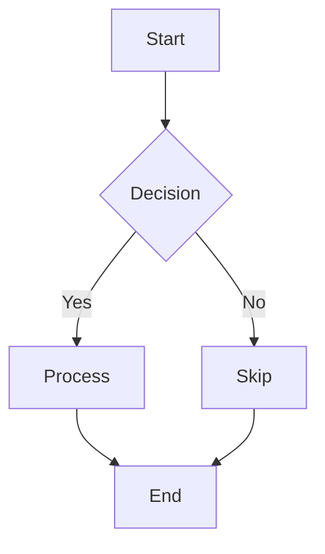
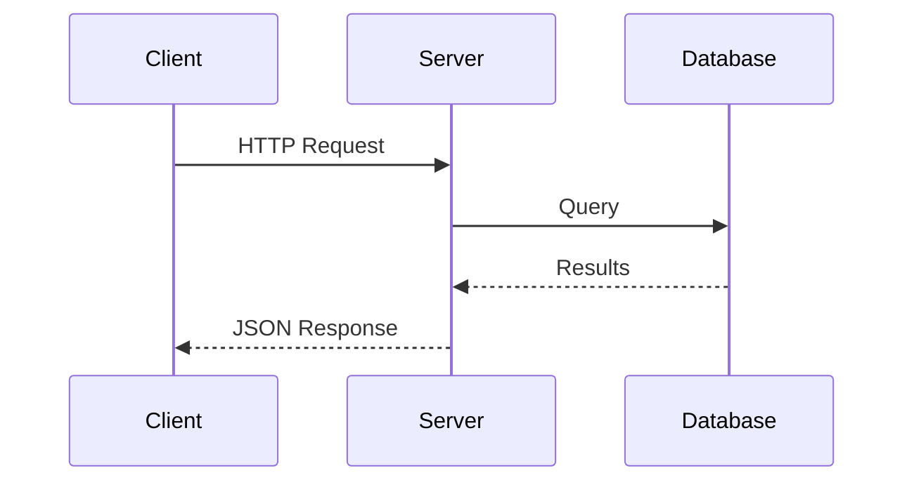

<!-- ascii_title -->
# Ostendo
<!-- section: showcase -->
<!-- font_size: 4 -->
<!-- loop_animation: sparkle(figlet) -->

AI-native terminal presentations, reimagined.

- Built in Rust for speed
- 29 themes with live switching
- Code execution in 8 languages
- Images, animations, and more

<!-- notes:
FEATURE: Title slide + FIGlet ASCII art + sparkle animation
EXPECTED: Large ASCII art title with twinkling star animation, accent color override
VERIFY: FIGlet renders in accent color, sparkle stars twinkle across slide, front matter parsed
-->

---

<!-- ascii_title -->
# Matrix Rain
<!-- section: showcase -->
<!-- font_size: 4 -->
<!-- loop_animation: matrix -->
<!-- font_transition: none -->

The Matrix has you...

- Looping ASCII rain effect
- Full-width character cascade
- Works on any terminal

<!-- notes:
FEATURE: Matrix rain loop animation
EXPECTED: Green cascading characters falling across the entire screen
VERIFY: Matrix rain animates continuously, content still readable beneath
-->

---

<!-- ascii_title -->
# Spin Cycle
<!-- section: showcase -->
<!-- font_size: 4 -->
<!-- loop_animation: spin -->
<!-- font_transition: none -->

ASCII character cycling on every cell

- Characters rotate through the ASCII ramp
- Creates a mesmerizing visual effect
- All content remains readable

<!-- notes:
FEATURE: Spin loop animation on ASCII art
EXPECTED: Characters cycling through ASCII density ramp
VERIFY: Spin animation runs continuously on all characters
-->

---

# Protocol Image Rendering
<!-- section: showcase -->
<!-- font_size: -2 -->
<!-- font_transition: none -->
<!-- image_render: ascii -->
<!-- fullscreen -->
<!-- align: center -->


- Auto-detects terminal protocol: Kitty, iTerm2, Sixel
- Falls back to ASCII art rendering
- Scale with `>` and `<` keys

<!-- notes:
FEATURE: Protocol image rendering (Kitty/iTerm2/Sixel/ASCII)
EXPECTED: opus.png renders as fullscreen centered ASCII art at small font
VERIFY: Image displays correctly as ASCII, fullscreen and centered
-->

---

# GIF Image
<!-- section: showcase -->
<!-- font_size: 4 -->
<!-- align: center -->
<!-- font_transition: none -->


<!-- notes:
FEATURE: GIF image rendering
EXPECTED: GIF renders as a static image (first frame) centered on screen
VERIFY: Image displays centered both vertically and horizontally
-->

---

# ASCII Art Image
<!-- section: showcase -->
<!-- font_size: -3 -->
<!-- image_render: ascii -->
<!-- fullscreen -->
<!-- align: center -->


- Rendered as ASCII art characters
- Font size -3 for maximum detail
- Works in any terminal emulator

<!-- notes:
FEATURE: ASCII art image rendering
EXPECTED: opus.png rendered as ASCII art characters at smallest font size
VERIFY: Image recognizable as ASCII art, font_size: -3 makes characters very small for detail
-->

---

# ASCII Art + Sparkle
<!-- section: showcase -->
<!-- font_size: -2 -->
<!-- image_render: ascii -->
<!-- loop_animation: sparkle(image) -->
<!-- font_transition: none -->
<!-- fullscreen -->
<!-- align: center -->


Twinkling stars overlay the ASCII art image

<!-- notes:
FEATURE: ASCII image + sparkle animation combo
EXPECTED: ASCII art image with twinkling star overlay animation, fullscreen centered
VERIFY: Stars animate on top of the ASCII art image, fullscreen and centered
-->

---

# ASCII Art + Spin
<!-- section: showcase -->
<!-- font_size: 1 -->
<!-- image_render: ascii -->
<!-- loop_animation: spin -->
<!-- font_transition: none -->


Characters cycle through ASCII density ramp

<!-- notes:
FEATURE: ASCII image + spin animation combo
EXPECTED: ASCII art image with characters cycling through density ramp
VERIFY: Spin animation runs on ASCII image characters
-->

---

# SVG Rendering
<!-- section: showcase -->
<!-- font_size: 4 -->
<!-- font_transition: none -->


- SVG rendered via rsvg-convert or ImageMagick
- Scales to terminal width automatically

<!-- notes:
FEATURE: SVG image rendering
EXPECTED: dakotacon.svg renders using available converter
VERIFY: SVG displays correctly with proper scaling
-->

---

# ASCII SVG + Sparkle
<!-- section: showcase -->
<!-- font_size: -1 -->
<!-- image_render: ascii -->
<!-- image_scale: 60 -->
<!-- loop_animation: sparkle(image) -->
<!-- font_transition: none -->


SVG as twinkling ASCII art

<!-- notes:
FEATURE: SVG as ASCII art with sparkle animation
EXPECTED: dakotacon.svg rendered as ASCII with twinkling stars at 60% scale
VERIFY: SVG renders as ASCII, sparkle animation overlays, image scaled to 60%
-->

---

# Image Color Override
<!-- section: showcase -->
<!-- font_size: 1 -->
<!-- image_render: ascii -->
<!-- image_color: #FF5500 -->
<!-- font_transition: none -->


Custom color applied to ASCII art via `image_color` directive

<!-- notes:
FEATURE: Image color override directive
EXPECTED: ASCII art rendered in orange (#FF5500) instead of default
VERIFY: All ASCII art characters use the overridden color
-->

---

# Image Scaling
<!-- section: showcase -->
<!-- font_size: 4 -->
<!-- image_scale: 30 -->
<!-- font_transition: none -->


- Scaled to 30% of terminal width
- Adjust live with `>` (bigger) and `<` (smaller)

<!-- notes:
FEATURE: Image scale directive
EXPECTED: Image rendered at 30% of terminal width
VERIFY: Image visibly smaller than full-width default
-->

---

# Live Code Execution
<!-- section: showcase -->
<!-- font_size: 4 -->
<!-- font_transition: none -->

```python +exec {label: "fibonacci.py"}
def fibonacci(n):
    """Generate Fibonacci sequence."""
    a, b = 0, 1
    for _ in range(n):
        yield a
        a, b = b, a + b

for num in fibonacci(12):
    print(num, end=" ")
```

- Press **Ctrl+E** to run code live
- Output streams below the code block
- Supports Python, Rust, Go, C, C++, Bash, Ruby, JavaScript

<!-- notes:
FEATURE: Live code execution with syntax highlighting
EXPECTED: Python code with colored syntax, executable with Ctrl+E
VERIFY: Code has syntax highlighting, Ctrl+E produces Fibonacci output
-->

---

# Auto-Wrap Execution
<!-- section: showcase -->
<!-- font_size: 4 -->
<!-- font_transition: none -->

```rust +exec {label: "no_main.rs"}
let mut fib = vec![0u64, 1];
for i in 2..15 {
    let next = fib[i - 1] + fib[i - 2];
    fib.push(next);
}
println!("Fibonacci: {:?}", fib);

fn is_even(n: u64) -> bool { n % 2 == 0 }

let even: Vec<&u64> = fib.iter().filter(|n| is_even(**n)).collect();
println!("Even only: {:?}", even);
```

- No `fn main()` needed — Ostendo auto-wraps bare code
- Helper functions extracted automatically
- Also works for Go and C

<!-- notes:
FEATURE: Rust auto-wrap execution (no fn main needed)
EXPECTED: Bare Rust code executes via automatic wrapping
VERIFY: Ctrl+E runs successfully, helper function extracted properly
-->

---

<!-- column_layout: [1, 1] -->
# Side-by-Side Columns
<!-- section: showcase -->
<!-- font_size: 3 -->
<!-- font_transition: none -->

<!-- column: 0 -->

```python +exec {label: "left.py"}
squares = [x**2 for x in range(8)]
print("Squares:", squares)
```

- Python list comprehension
- Press Ctrl+E to execute

<!-- column: 1 -->

```bash +exec {label: "right.sh"}
echo "User: $(whoami)"
echo "Shell: $SHELL"
echo "Date: $(date +%Y-%m-%d)"
```

- Bash system commands
- Also executable

<!-- reset_layout -->

<!-- notes:
FEATURE: Column layout with executable code
EXPECTED: Two side-by-side columns, each with code blocks and bullets
VERIFY: Columns render evenly, both code blocks have +exec badges
-->

---

<!-- ascii_title -->
# Bounce
<!-- section: showcase -->
<!-- font_size: 4 -->
<!-- loop_animation: bounce -->
<!-- font_transition: none -->

A bouncing ball traverses the screen

- Full-width bounce animation
- Ball overlays all content
- ASCII art titles bounce too

<!-- notes:
FEATURE: Bounce loop animation with FIGlet title
EXPECTED: Bouncing ball animation across the screen with ASCII art title
VERIFY: Ball bounces continuously, content readable beneath
-->

---

<!-- ascii_title -->
# Pulse
<!-- section: showcase -->
<!-- font_size: 4 -->
<!-- loop_animation: pulse -->
<!-- font_transition: none -->

Content fades in and out rhythmically

- Smooth brightness oscillation
- All content pulses together

<!-- notes:
FEATURE: Pulse loop animation with FIGlet title
EXPECTED: Content brightness oscillates smoothly
VERIFY: Text brightness pulses continuously
-->

---

# Typewriter Entrance
<!-- section: animations -->
<!-- font_size: 4 -->
<!-- animation: typewriter -->
<!-- font_transition: none -->

- Characters appear one at a time
- Creates a typing effect
- Works with all content types

<!-- notes:
FEATURE: Typewriter entrance animation
EXPECTED: Content appears character-by-character from left to right
VERIFY: Typing animation visible on slide entry
-->

---

# Fade In Entrance
<!-- section: animations -->
<!-- font_size: 4 -->
<!-- animation: fade_in -->
<!-- font_transition: none -->

- Content fades from dim to full brightness
- Smooth opacity transition
- Professional reveal effect

<!-- notes:
FEATURE: Fade-in entrance animation
EXPECTED: Content starts dim and brightens to full opacity
VERIFY: Fade animation visible on slide entry
-->

---

# Slide Down Entrance
<!-- section: animations -->
<!-- font_size: 4 -->
<!-- animation: slide_down -->
<!-- font_transition: none -->

- Content slides in from the top
- Row by row reveal
- Dynamic slide entry effect

<!-- notes:
FEATURE: Slide-down entrance animation
EXPECTED: Content slides in from top of screen
VERIFY: Slide-down animation visible on slide entry
-->

---

# Dissolve Transition
<!-- section: animations -->
<!-- font_size: 4 -->
<!-- transition: dissolve -->
<!-- font_transition: none -->

- Per-character scatter reveal
- Random dissolve pattern
- Set via `transition: dissolve` directive

Navigate to the next slide to see it in action.

<!-- notes:
FEATURE: Dissolve slide transition
EXPECTED: Content dissolves per-character when leaving this slide
VERIFY: Dissolve animation plays when navigating away
-->

---

# Slide Transition
<!-- section: animations -->
<!-- font_size: 4 -->
<!-- transition: slide -->
<!-- font_transition: none -->

- Content slides off to the left
- New content slides in from right
- Set via `transition: slide` directive

<!-- notes:
FEATURE: Slide transition
EXPECTED: Content slides horizontally when transitioning
VERIFY: Slide animation plays when navigating away
-->

---

# Combined Animation
<!-- section: animations -->
<!-- font_size: 4 -->
<!-- transition: dissolve -->
<!-- animation: typewriter -->
<!-- loop_animation: sparkle -->
<!-- font_transition: none -->

- Dissolve transition IN
- Typewriter entrance reveals content
- Sparkle loop runs continuously
- All three animations layer together

<!-- notes:
FEATURE: Combined transition + entrance + loop animation
EXPECTED: Dissolve in, then typewriter reveal, then sparkle runs
VERIFY: All three animation layers work together without conflict
-->

---

# Font Size Transition
<!-- section: animations -->
<!-- font_size: 6 -->

This slide uses `font_size: 6` with the default dissolve font transition.

- Dissolve-out old content
- Smooth font stepping
- Dissolve-in new content
- Navigate away and back to see it

<!-- notes:
FEATURE: Font size change with dissolve transition (default)
EXPECTED: Font zoom dissolve animation when entering this slide
VERIFY: Dissolve-out, font steps, dissolve-in animation plays
-->

---

# No Font Transition
<!-- section: animations -->
<!-- font_size: 2 -->
<!-- font_transition: none -->

This slide uses `font_size: 2` with `font_transition: none`.

- Font changes instantly
- No dissolve animation
- Faster slide transitions
- Useful for slides with many small details

<!-- notes:
FEATURE: Font transition: none directive
EXPECTED: Font size changes without dissolve animation
VERIFY: Instant font change, no dissolve effect
-->

---

# Font Transition: Dissolve
<!-- section: animations -->
<!-- font_size: 5 -->
<!-- font_transition: dissolve -->

This slide explicitly sets `font_transition: dissolve`.

- Same as the default behavior
- Dissolve-out + font stepping + dissolve-in
- Smooth cinematic feel

<!-- notes:
FEATURE: Font transition: dissolve directive (explicit)
EXPECTED: Font zoom dissolve animation (same as default)
VERIFY: Dissolve animation plays on font size change
-->

---

# Mermaid Diagram: Flowchart
<!-- section: diagrams -->
<!-- font_size: 4 -->
<!-- font_transition: none -->



- Rendered via `mmdc` (Mermaid CLI)
- Displays as terminal image

<!-- notes:
FEATURE: Mermaid flowchart diagram
EXPECTED: Flowchart renders as an image via mmdc CLI
VERIFY: Diagram displays as rendered image, not raw text
-->

---

# Mermaid: Sequence Diagram
<!-- section: diagrams -->
<!-- font_size: 4 -->
<!-- font_transition: none -->



<!-- notes:
FEATURE: Mermaid sequence diagram
EXPECTED: Sequence diagram renders as an image
VERIFY: Diagram displays correctly with participants and messages
-->

---

# Title Decoration: Box
<!-- section: decorations -->
<!-- font_size: 4 -->
<!-- title_decoration: box -->
<!-- font_transition: none -->

- Title is enclosed in a box
- Set via `title_decoration: box`
- Uses box-drawing border characters

<!-- notes:
FEATURE: Title decoration box style
EXPECTED: Title enclosed in a box with border characters
VERIFY: Box border visible around title text
-->

---

# Title Decoration: Banner
<!-- section: decorations -->
<!-- font_size: 4 -->
<!-- title_decoration: banner -->
<!-- font_transition: none -->

- Title has a full-width accent background
- Set via `title_decoration: banner`
- High-impact section header style

<!-- notes:
FEATURE: Title decoration banner style
EXPECTED: Title with full-width accent background bar
VERIFY: Banner background visible behind title
-->

---

# Title Decoration: Underline
<!-- section: decorations -->
<!-- font_size: 4 -->
<!-- title_decoration: underline -->
<!-- font_transition: none -->

- Title has an accent-colored underline
- Set via `title_decoration: underline`
- Clean, minimal decoration

<!-- notes:
FEATURE: Title decoration underline style
EXPECTED: Accent-colored line beneath the title
VERIFY: Underline visible below title text
-->

---

# Title Decoration: None
<!-- section: decorations -->
<!-- font_size: 4 -->
<!-- title_decoration: none -->
<!-- font_transition: none -->

- No decoration on the title
- Set via `title_decoration: none`
- Plain title rendering

<!-- notes:
FEATURE: Title decoration none
EXPECTED: Title renders without any decoration
VERIFY: No underline, box, or banner around title
-->

---

# Vertical Centering
<!-- section: layout -->
<!-- font_size: 4 -->
<!-- align: center -->
<!-- font_transition: none -->

This content is vertically and horizontally centered.

- Set via `align: center`
- Also supports `vcenter` and `hcenter`

<!-- notes:
FEATURE: Vertical centering alignment
EXPECTED: Content centered both vertically and horizontally
VERIFY: Content appears in the middle of the screen
-->

---

# Per-Slide Footer
<!-- section: layout -->
<!-- font_size: 4 -->
<!-- footer: Conference Presentation - Page 34 -->
<!-- font_transition: none -->

- Footer appears at the bottom of the screen
- Set via `footer:` directive per slide
- Supports left, center, and right alignment

<!-- notes:
FEATURE: Per-slide footer bar
EXPECTED: Footer text visible at bottom of screen
VERIFY: Footer shows "Conference Presentation - Page 34" at bottom
-->

---

# Footer: Center Aligned
<!-- section: layout -->
<!-- font_size: 4 -->
<!-- footer: Centered Footer Text -->
<!-- footer_align: center -->
<!-- font_transition: none -->

Footer text centered at the bottom.

<!-- notes:
FEATURE: Footer center alignment
EXPECTED: Footer text centered at bottom
VERIFY: Footer text appears centered horizontally
-->

---

# Footer: Right Aligned
<!-- section: layout -->
<!-- font_size: 4 -->
<!-- footer: Right-Aligned Footer -->
<!-- footer_align: right -->
<!-- font_transition: none -->

Footer text right-aligned at the bottom.

<!-- notes:
FEATURE: Footer right alignment
EXPECTED: Footer text right-aligned at bottom
VERIFY: Footer text appears on the right side
-->

---

# Bullet Depths
<!-- section: formatting -->
<!-- font_size: 4 -->
<!-- font_transition: none -->

- Top level bullet (depth 0, accent marker)
- Another top level
  - Second level indent (depth 1)
  - Another second level
    - Third level deep (depth 2)
    - Another deep bullet
- Back to top level

<!-- notes:
FEATURE: Bullet depth levels
EXPECTED: Three distinct indent levels with different bullet markers
VERIFY: Level 0 (*), level 1 (-), level 2 (>) at increasing indents
-->

---

# Inline Formatting
<!-- section: formatting -->
<!-- font_size: 4 -->
<!-- font_transition: none -->

- **Bold text** renders heavier
- *Italic text* renders slanted
- ~~Strikethrough~~ has a line through
- `inline code` has a background
- **Bold *and italic* mixed** in one span
- Text with ~~strike~~ and **bold** and `code`

<!-- notes:
FEATURE: All inline formatting types
EXPECTED: Bold, italic, strikethrough, inline code all render correctly
VERIFY: Each format type renders correctly without bleeding into others
-->

---

# Subtitle Display
<!-- section: formatting -->
<!-- font_size: 4 -->
<!-- font_transition: none -->

This line is the subtitle — slightly dimmer than regular content

- Subtitles are the first non-directive text after the title
- Inline formatting in subtitles: **bold** and *italic* work

<!-- notes:
FEATURE: Subtitle extraction and display
EXPECTED: Subtitle renders dimmer than regular content
VERIFY: Subtitle text visible between title and bullets
-->

---

# Code Execution: Python
<!-- section: code -->
<!-- font_size: 4 -->
<!-- font_transition: none -->

```python +exec {label: "hello.py"}
import sys
print("Hello from Ostendo!")
print(f"Python {sys.version_info.major}.{sys.version_info.minor}")
```

- Press Ctrl+E to execute
- Output streams below the code block

<!-- notes:
FEATURE: Python code execution
EXPECTED: Python code with syntax highlighting, Ctrl+E runs it
VERIFY: +exec badge visible, output shows Python version
-->

---

# Code Execution: Bash
<!-- section: code -->
<!-- font_size: 4 -->
<!-- font_transition: none -->

```bash +exec {label: "system_info.sh"}
echo "User: $(whoami)"
echo "Shell: $SHELL"
echo "Date: $(date +%Y-%m-%d)"
echo "PWD: $(pwd)"
```

<!-- notes:
FEATURE: Bash code execution
EXPECTED: Bash script executes with Ctrl+E
VERIFY: Output displays user, shell, date, working directory
-->

---

# Code Execution: Ruby
<!-- section: code -->
<!-- font_size: 4 -->
<!-- font_transition: none -->

```ruby +exec {label: "ruby_demo.rb"}
puts "Hello from Ruby!"
puts "Ruby version: #{RUBY_VERSION}"
3.times { |i| puts "  Count: #{i + 1}" }
```

<!-- notes:
FEATURE: Ruby code execution
EXPECTED: Ruby code executes via `ruby -e`
VERIFY: Ruby output visible with version and count loop
-->

---

# Code Execution: Rust
<!-- section: code -->
<!-- font_size: 4 -->
<!-- font_transition: none -->

```rust +exec {label: "example.rs"}
fn main() {
    let numbers: Vec<i32> = (1..=5).collect();
    let sum: i32 = numbers.iter().sum();
    println!("Numbers: {:?}", numbers);
    println!("Sum: {}", sum);
}
```

<!-- notes:
FEATURE: Rust code execution with syntax highlighting
EXPECTED: Rust code with colored keywords, Ctrl+E executes
VERIFY: Syntax highlighting correct for fn, let, Vec, println!
-->

---

# Code Execution: Go
<!-- section: code -->
<!-- font_size: 4 -->
<!-- font_transition: none -->

```go +exec {label: "main.go"}
package main

import "fmt"

func main() {
    fruits := []string{"apple", "banana", "cherry"}
    for i, f := range fruits {
        fmt.Printf("%d: %s\n", i, f)
    }
}
```

<!-- notes:
FEATURE: Go code execution
EXPECTED: Go code with syntax highlighting, Ctrl+E executes
VERIFY: Go keywords colored correctly
-->

---

# Go Auto-Wrap
<!-- section: code -->
<!-- font_size: 4 -->
<!-- font_transition: none -->

```go +exec {label: "auto_wrap.go"}
for i := 1; i <= 20; i++ {
    switch {
    case i%15 == 0:
        fmt.Println("FizzBuzz")
    case i%3 == 0:
        fmt.Println("Fizz")
    case i%5 == 0:
        fmt.Println("Buzz")
    default:
        fmt.Println(i)
    }
}
```

- No `package main` / `func main()` needed

<!-- notes:
FEATURE: Go auto-wrap execution
EXPECTED: Bare Go code executes via auto-wrapping
VERIFY: Ctrl+E shows FizzBuzz sequence
-->

---

# Code Execution: C
<!-- section: code -->
<!-- font_size: 4 -->
<!-- font_transition: none -->

```c +exec {label: "hello.c"}
#include <stdio.h>

int main() {
    int nums[] = {1, 2, 3, 4, 5};
    int sum = 0;
    for (int i = 0; i < 5; i++) {
        sum += nums[i];
    }
    printf("Sum: %d\n", sum);
    return 0;
}
```

<!-- notes:
FEATURE: C code execution
EXPECTED: C code compiles and executes with Ctrl+E
VERIFY: Output shows sum of array
-->

---

# C Auto-Wrap
<!-- section: code -->
<!-- font_size: 4 -->
<!-- font_transition: none -->

```c +exec {label: "auto_wrap.c"}
int factorial(int n) {
    if (n <= 1) return 1;
    return n * factorial(n - 1);
}

for (int i = 1; i <= 10; i++) {
    printf("%d! = %d\n", i, factorial(i));
}
```

- No `int main()` needed — auto-wrapped with standard includes
- Helper functions extracted before main

<!-- notes:
FEATURE: C auto-wrap execution
EXPECTED: Bare C code with helper function executes via auto-wrapping
VERIFY: Ctrl+E shows factorials 1-10
-->

---

# Code Execution: C++
<!-- section: code -->
<!-- font_size: 4 -->
<!-- font_transition: none -->

```cpp +exec {label: "demo.cpp"}
#include <iostream>
#include <vector>
#include <algorithm>

int main() {
    std::vector<int> v = {5, 3, 1, 4, 2};
    std::sort(v.begin(), v.end());
    for (auto x : v) {
        std::cout << x << " ";
    }
    std::cout << std::endl;
    return 0;
}
```

<!-- notes:
FEATURE: C++ code execution
EXPECTED: C++ code compiles and executes
VERIFY: Output shows sorted vector
-->

---

<!-- column_layout: [1, 1] -->
# Code Execution: JavaScript
<!-- section: code -->
<!-- font_size: 3 -->
<!-- font_transition: none -->

<!-- column: 0 -->

```javascript +exec {label: "demo.js"}
const greet = (name) => `Hello, ${name}!`;
console.log(greet("Ostendo"));
console.log("Array:", [1, 2, 3].map(x => x * 2));
```

<!-- column: 1 -->

```bash +exec {label: "info.sh"}
echo "Platform: $(uname -s)"
echo "Node: $(node --version 2>/dev/null || echo 'N/A')"
echo "Date: $(date +%Y-%m-%d)"
```

<!-- reset_layout -->

<!-- notes:
FEATURE: JavaScript + Bash side-by-side code execution
EXPECTED: Two-column layout with JS on left, Bash on right
VERIFY: Both code blocks executable via Ctrl+E, columns render correctly
-->

---

# Multiple Executable Blocks
<!-- section: code -->
<!-- font_size: 4 -->
<!-- font_transition: none -->

```rust +exec {label: "example.rs"}
fn main() {
    println!("Hello, Rust!");
}
```

```bash +exec {label: "usage.sh"}
echo "Ostendo v0.2.1"
echo "Built with Rust"
```

- Ctrl+E cycles through executable blocks
- Each block can be run independently

<!-- notes:
FEATURE: Multiple executable code blocks per slide
EXPECTED: Two code blocks, Ctrl+E cycles between them
VERIFY: Both blocks have +exec badges, Ctrl+E cycles
-->

---

# Code Preamble
<!-- section: code -->
<!-- font_size: 4 -->
<!-- font_transition: none -->

<!-- preamble_start: python -->
import math
<!-- preamble_end -->

```python +exec {label: "with_preamble.py"}
print(f"Pi = {math.pi:.6f}")
print(f"sqrt(2) = {math.sqrt(2):.6f}")
print(f"e = {math.e:.6f}")
```

- Preamble imports are injected before execution
- Hidden from the slide display
- Set via `preamble_start`/`preamble_end` directives

<!-- notes:
FEATURE: Code preamble directive
EXPECTED: Hidden import injected before code execution
VERIFY: math module available without visible import in code block
-->

---

# PTY Mode
<!-- section: code -->
<!-- font_size: 4 -->
<!-- font_transition: none -->

```bash +pty {label: "interactive.sh"}
echo "Hello from PTY mode"
sleep 0.5
echo "This runs in a pseudo-terminal"
```

- PTY mode allocates a pseudo-terminal
- Supports interactive programs
- Set via `+pty` instead of `+exec`

<!-- notes:
FEATURE: PTY mode code execution
EXPECTED: Code runs in a pseudo-terminal
VERIFY: +pty badge visible, PTY execution works
-->

---

# Basic Table
<!-- section: tables -->
<!-- font_size: 4 -->
<!-- font_transition: none -->

| Feature | Status | Version |
|---------|--------|---------|
| Themes | 29 themes | v0.1.0 |
| Animations | 8 types | v0.2.0 |
| Code Exec | 8 languages | v0.2.0 |
| Mermaid | Flowcharts | v0.2.0 |
| Remote | WebSocket | v0.2.1 |
| Gradients | 6 themes | v0.2.1 |

<!-- notes:
FEATURE: Table rendering
EXPECTED: Table with borders, headers, and aligned columns
VERIFY: Table renders with proper borders and column alignment
-->

---

# Table Alignment
<!-- section: tables -->
<!-- font_size: 4 -->
<!-- font_transition: none -->

| Left | Center | Right |
|:-----|:------:|------:|
| Alpha | Bravo | Charlie |
| 100 | 200 | 300 |
| short | medium length | very long text |

- Columns support left, center, right alignment
- Set via `:` markers in separator row

<!-- notes:
FEATURE: Table column alignment
EXPECTED: Columns aligned left, center, and right respectively
VERIFY: Text alignment matches the header separator markers
-->

---

# Blockquotes
<!-- section: formatting -->
<!-- font_size: 4 -->
<!-- font_transition: none -->

> "The best way to predict the future is to invent it."
> — Alan Kay

- Blockquotes render with accent-colored left border
- Support inline formatting: **bold** and *italic*

> "Any sufficiently advanced technology is indistinguishable from magic."
> — Arthur C. Clarke

<!-- notes:
FEATURE: Blockquote rendering
EXPECTED: Quotes with accent-colored left border
VERIFY: Left border visible, inline formatting works within quotes
-->

---

<!-- column_layout: [1, 1] -->
# Two Equal Columns
<!-- section: columns -->
<!-- font_size: 4 -->
<!-- font_transition: none -->

<!-- column: 0 -->

**Left Column**

- First bullet
- Second bullet
- Third bullet

<!-- column: 1 -->

**Right Column**

- Alpha item
- Beta item
- Gamma item

<!-- reset_layout -->

<!-- notes:
FEATURE: Two equal columns
EXPECTED: Content split evenly into two columns
VERIFY: Columns render side-by-side with equal width
-->

---

<!-- column_layout: [2, 1] -->
# Asymmetric Columns
<!-- section: columns -->
<!-- font_size: 4 -->
<!-- font_transition: none -->

<!-- column: 0 -->

**Wide Column (2:1 ratio)**

- This column takes 2/3 of the width
- Great for main content with sidebar
- Supports all content types

<!-- column: 1 -->

**Sidebar**

- Narrow column
- 1/3 width

<!-- reset_layout -->

<!-- notes:
FEATURE: Asymmetric column layout
EXPECTED: Left column takes 2/3 width, right takes 1/3
VERIFY: Columns render with correct width ratio
-->

---

<!-- column_layout: [1, 1, 1] -->
# Three Columns
<!-- section: columns -->
<!-- font_size: 4 -->
<!-- font_transition: none -->

<!-- column: 0 -->

**Column A**

- Item 1
- Item 2

<!-- column: 1 -->

**Column B**

- Item 3
- Item 4

<!-- column: 2 -->

**Column C**

- Item 5
- Item 6

<!-- reset_layout -->

<!-- notes:
FEATURE: Three equal columns
EXPECTED: Content split into three equal-width columns
VERIFY: Three columns render side-by-side
-->

---

<!-- column_layout: [3, 2] -->
# Columns with Code
<!-- section: columns -->
<!-- font_size: 4 -->
<!-- font_transition: none -->

<!-- column: 0 -->

```python {label: "example.py"}
def greet(name):
    return f"Hello, {name}!"

print(greet("World"))
```

<!-- column: 1 -->

**Output**

- Returns greeting string
- Uses f-string formatting
- Simple function example

<!-- reset_layout -->

<!-- notes:
FEATURE: Columns with code blocks
EXPECTED: Code block in wider column, bullets in narrower column
VERIFY: Code renders with syntax highlighting inside column
-->

---

# Speaker Notes
<!-- section: features -->
<!-- font_size: 4 -->
<!-- font_transition: none -->

- Press **n** to toggle the notes panel
- Press **Shift+N** to scroll notes down
- Press **Shift+P** to scroll notes up
- Notes are visible in the remote control too

<!-- notes:
FEATURE: Speaker notes with scrolling
EXPECTED: Notes panel toggles with 'n' key, scrollable
VERIFY: Notes appear at bottom of screen, scroll with Shift+N/P
TALKING POINTS:
- Speaker notes are a key feature for presenters
- The notes panel shows at the bottom of the screen
- Shift+N scrolls down, Shift+P scrolls up
- Notes are also visible in the WebSocket remote control UI
- This is line 5 of the notes
- This is line 6 — should require scrolling
- This is line 7 — definitely needs scrolling
- This is line 8 — testing the scroll limits
-->

---

# Timing Directive
<!-- section: features -->
<!-- font_size: 4 -->
<!-- timing: 2.0 -->
<!-- font_transition: none -->

- This slide has a 2-minute timing directive
- Timer visible in the status bar
- Start with **t**, reset with **T**

<!-- notes:
FEATURE: Timing directive
EXPECTED: 2.0 minute timing shown in status bar
VERIFY: Timing indicator visible, timer starts with 't' key
-->

---

# Theme Switching
<!-- section: features -->
<!-- font_size: 4 -->
<!-- font_transition: none -->

- 29 built-in themes available
- Switch via `:theme slug` command
- Press **K** to cycle through themes
- Press **D** to toggle dark/light variant
- Theme persists across restarts

<!-- notes:
FEATURE: Theme switching with 29 themes
EXPECTED: Themes switchable via command or K key
VERIFY: K cycles themes, D toggles dark/light, colors change
-->

---

# Scale & Font Controls
<!-- section: features -->
<!-- font_size: 4 -->
<!-- font_transition: none -->

- **+/-** — Adjust global scale (zoom)
- **]** — Increase font size (Kitty/Ghostty)
- **[** — Decrease font size
- **>/<** — Adjust image scale
- Per-slide font offsets persist in state

<!-- notes:
FEATURE: Scale and font size controls
EXPECTED: Multiple adjustment controls available
VERIFY: +/- changes scale, ]/[ changes font, >/< changes images
-->

---

# Fullscreen Mode
<!-- section: features -->
<!-- font_size: 4 -->
<!-- font_transition: none -->

- Press **f** to toggle fullscreen
- Hides status bar and progress bar
- Per-slide fullscreen via `fullscreen: true` directive
- User toggle is sticky until next slide

<!-- notes:
FEATURE: Fullscreen mode toggle
EXPECTED: Status bar disappears in fullscreen mode
VERIFY: 'f' toggles fullscreen, status bar hides/shows
-->

---

# Fullscreen Directive
<!-- section: features -->
<!-- font_size: 4 -->
<!-- fullscreen: true -->
<!-- font_transition: none -->

This slide uses `fullscreen: true` — no status bar.

- Navigate away and back to confirm it reapplies
- Press **f** to manually override

<!-- notes:
FEATURE: Per-slide fullscreen directive
EXPECTED: Status bar hidden automatically on this slide
VERIFY: No status bar visible, 'f' can override
-->

---

# Overview Mode
<!-- section: features -->
<!-- font_size: 4 -->
<!-- font_transition: none -->

- Press **o** to enter overview mode
- Shows slide titles in a list
- Navigate with arrow keys
- Press Enter to jump to a slide

<!-- notes:
FEATURE: Overview mode
EXPECTED: Overview shows slide list, navigable
VERIFY: 'o' enters overview, arrows navigate, Enter selects
-->

---

# Help Screen
<!-- section: features -->
<!-- font_size: 4 -->
<!-- font_transition: none -->

- Press **?** to toggle the help screen
- Shows all keybindings organized by category
- Press **?** again or **Esc** to dismiss

<!-- notes:
FEATURE: Help screen
EXPECTED: Help screen shows all keybindings
VERIFY: '?' toggles help, keybindings visible
-->

---

# Hot Reload
<!-- section: features -->
<!-- font_size: 4 -->
<!-- font_transition: none -->

- Edit the markdown file while presenting
- Changes reload automatically (500ms poll)
- Slide position preserved on reload
- Force reload with `:reload` command

<!-- notes:
FEATURE: Hot reload file watching
EXPECTED: File changes auto-reload the presentation
VERIFY: Edit file externally, presentation updates
-->

---

# Remote Control
<!-- section: features -->
<!-- font_size: 4 -->
<!-- font_transition: none -->

- Start with `--remote` flag
- Opens WebSocket server on port 9090
- Web UI at `http://127.0.0.1:9090`
- Full control: navigation, themes, toggles
- Dynamic theme color adaptation

<!-- notes:
FEATURE: WebSocket remote control
EXPECTED: Remote UI accessible via browser
VERIFY: Browser shows remote control with all features
-->

---

# Light/Dark Toggle
<!-- section: features -->
<!-- font_size: 4 -->
<!-- font_transition: none -->

- Press **D** to toggle between dark and light variants
- Not all themes have light variants
- Light themes have enhanced contrast for readability

<!-- notes:
FEATURE: Light/dark mode toggle
EXPECTED: D key toggles between dark and light theme variant
VERIFY: Colors switch between dark and light mode
-->

---

# Section Navigation
<!-- section: navigation -->
<!-- show_section: true -->
<!-- font_size: 4 -->
<!-- font_transition: none -->

- Press **Shift+Right** for next section
- Press **Shift+Left** for previous section
- Section name visible in status bar
- Toggle section display with **s**

<!-- notes:
FEATURE: Section navigation and display
EXPECTED: Section jumps work, section name in status bar
VERIFY: Shift+arrows jump sections, section visible
-->

---

# Mouse & Scroll
<!-- section: navigation -->
<!-- font_size: 4 -->
<!-- font_transition: none -->

- Mouse click advances slides
- Scroll wheel scrolls long content
- Right-click goes to previous slide
- Touch/swipe on mobile remote

<!-- notes:
FEATURE: Mouse and scroll support
EXPECTED: Mouse interactions work for navigation
VERIFY: Click advances, scroll works, right-click goes back
-->

---

# Goto Slide
<!-- section: navigation -->
<!-- font_size: 4 -->
<!-- font_transition: none -->

- Press **g** then type slide number
- Press **Enter** to jump
- Or use `:goto N` command
- Slides numbered from 1

<!-- notes:
FEATURE: Goto slide navigation
EXPECTED: Direct slide navigation by number
VERIFY: 'g' enters goto mode, number + Enter jumps
-->

---

# Command Mode
<!-- section: navigation -->
<!-- font_size: 4 -->
<!-- font_transition: none -->

- Press **:** to enter command mode
- Available commands:
  - `:theme slug` — switch theme
  - `:goto N` — jump to slide
  - `:notes` — toggle notes
  - `:timer reset` — reset timer
  - `:reload` — force reload
  - `:overview` — enter overview
  - `:help` — show help

<!-- notes:
FEATURE: Command mode
EXPECTED: ':' enters command mode, commands execute
VERIFY: Commands work as documented
-->

---

# HTML Export
<!-- section: export -->
<!-- font_size: 4 -->
<!-- font_transition: none -->

- Export with `--export output.html`
- Self-contained single HTML file
- Themed with current theme colors
- All content preserved

```bash
ostendo presentation.md --export slides.html
```

<!-- notes:
FEATURE: HTML export
EXPECTED: Exports self-contained HTML file
VERIFY: --export flag produces valid HTML
-->

---

# PDF Export
<!-- section: export -->
<!-- font_size: 4 -->
<!-- font_transition: none -->

- Export with `--export output.pdf`
- Uses headless Chrome or wkhtmltopdf
- One page per slide
- Preserves layout and colors

```bash
ostendo presentation.md --export slides.pdf
```

<!-- notes:
FEATURE: PDF export
EXPECTED: Exports PDF via headless browser
VERIFY: --export flag produces valid PDF
-->

---

# Horizontal Centering
<!-- section: layout -->
<!-- font_size: 4 -->
<!-- align: hcenter -->
<!-- font_transition: none -->

This content is horizontally centered only.

- Set via `align: hcenter`
- Vertical position stays at top

<!-- notes:
FEATURE: Horizontal centering only
EXPECTED: Content centered horizontally, top-aligned vertically
VERIFY: Content centered horizontally but at top of slide
-->

---

# Vertical Centering Only
<!-- section: layout -->
<!-- font_size: 4 -->
<!-- align: vcenter -->
<!-- font_transition: none -->

This content is vertically centered only.

- Set via `align: vcenter`
- Horizontal position stays at left

<!-- notes:
FEATURE: Vertical centering only
EXPECTED: Content centered vertically, left-aligned horizontally
VERIFY: Content centered vertically but left-aligned
-->

---

# OSC 66: Title Scale
<!-- section: scaling -->
<!-- font_size: 4 -->
<!-- title_scale: 3 -->
<!-- font_transition: none -->

This slide uses `title_scale: 3` for a large title.

- OSC 66 per-element text scaling (Kitty only)
- Title and subtitle rendered at 3x scale
- Body text remains normal size

<!-- notes:
FEATURE: OSC 66 title scaling
EXPECTED: Title rendered at 3x scale (Kitty terminal)
VERIFY: Title appears much larger than body text
-->

---

# OSC 66: Text Scale
<!-- section: scaling -->
<!-- font_size: 4 -->
<!-- text_scale: 2 -->
<!-- font_transition: none -->

This slide uses `text_scale: 2` for title and subtitle scaling.

- Scales title and subtitle only
- Body content stays at normal size

<!-- notes:
FEATURE: OSC 66 text scaling
EXPECTED: Title/subtitle at 2x scale (Kitty terminal)
VERIFY: Title/subtitle larger, body text normal
-->

---

# Combined Scaling
<!-- section: scaling -->
<!-- font_size: 5 -->
<!-- title_scale: 3 -->

This slide combines `font_size: 5` with `title_scale: 3`.

- Font zoom transition happens first
- Then OSC 66 scales the title
- Both effects stack

<!-- notes:
FEATURE: Combined font_size + title_scale
EXPECTED: Font zoom dissolve + large title scale
VERIFY: Font transition plays, then title appears at 3x scale
-->

---

# Scroll Test
<!-- section: edge-cases -->
<!-- font_size: 4 -->
<!-- font_transition: none -->

- Item 1: This is a bullet point
- Item 2: Testing vertical scroll
- Item 3: Content that overflows
- Item 4: The visible area
- Item 5: Should scroll with j/k
- Item 6: Or mouse wheel
- Item 7: Or Shift+N/P for notes
- Item 8: Keep scrolling
- Item 9: Almost there
- Item 10: Getting deeper
- Item 11: Into the content
- Item 12: Still more items
- Item 13: Testing scroll bounds
- Item 14: Near the end
- Item 15: This should require scrolling
- Item 16: On most terminals
- Item 17: With default font size
- Item 18: Almost at the bottom
- Item 19: Penultimate item
- Item 20: Final bullet point

<!-- notes:
FEATURE: Vertical scrolling for long content
EXPECTED: Content scrolls when it exceeds visible area
VERIFY: j/k or scroll wheel scrolls content up/down
-->

---

# Mixed Scroll Test
<!-- section: edge-cases -->
<!-- font_size: 4 -->
<!-- font_transition: none -->

```python {label: "scroll_test.py"}
# This code block adds height
for i in range(5):
    print(f"Line {i}")
```

> "A blockquote that adds more vertical content to force scrolling behavior."

- Bullet 1: After the code and quote
- Bullet 2: More content
- Bullet 3: Still going
- Bullet 4: Testing mixed content scroll

| Column A | Column B |
|----------|----------|
| Data 1   | Data 2   |
| Data 3   | Data 4   |

- Final bullet after table

<!-- notes:
FEATURE: Mixed content scrolling
EXPECTED: Code + blockquote + bullets + table all scroll together
VERIFY: Scroll works across different content types
-->

---

# Empty Title Slide
<!-- section: edge-cases -->
<!-- font_size: 4 -->
<!-- font_transition: none -->

- This slide has no decorative title styling
- Just plain content with bullets
- Testing minimal slide rendering

<!-- notes:
FEATURE: Plain title without special styling
EXPECTED: Title renders as standard bold accent text
VERIFY: No ASCII art, no decoration, just plain title
-->

---

# All Directives
<!-- section: edge-cases -->
<!-- font_size: 4 -->
<!-- font_transition: none -->

Every directive available in Ostendo:

- `section`, `timing`, `font_size`, `font_transition`
- `ascii_title`, `align`, `fullscreen`, `show_section`
- `title_decoration`, `footer`, `footer_align`
- `transition`, `animation`, `loop_animation`
- `column_layout`, `column`, `reset_layout`
- `image_render`, `image_scale`, `image_color`
- `text_scale`, `title_scale`
- `preamble_start`, `preamble_end`

<!-- notes:
FEATURE: Directive reference
EXPECTED: All directives listed for reference
VERIFY: All directive names match parser regex patterns
-->

---

# CLI Flags
<!-- section: reference -->
<!-- font_size: 4 -->
<!-- font_transition: none -->

| Flag | Description |
|------|-------------|
| `file` | Path to markdown file |
| `--theme slug` | Set theme (default: terminal_green) |
| `--slide N` | Start at slide N |
| `--image-mode` | Force image protocol |
| `--remote` | Enable remote control |
| `--remote-port N` | Set remote port (default: 9090) |
| `--export file` | Export to HTML or PDF |
| `--validate` | Validate presentation |
| `--list-themes` | List available themes |
| `--detect-protocol` | Show detected image protocol |

<!-- notes:
FEATURE: CLI flags reference
EXPECTED: Table showing all CLI flags
VERIFY: All flags documented and current
-->

---

# Keybindings
<!-- section: reference -->
<!-- font_size: 3 -->
<!-- font_transition: none -->

| Key | Action | Key | Action |
|-----|--------|-----|--------|
| Right/l | Next slide | Left/h | Previous slide |
| Shift+Right | Next section | Shift+Left | Previous section |
| g + N | Goto slide N | : | Command mode |
| j/Down | Scroll down | k/Up | Scroll up |
| +/= | Scale up | - | Scale down |
| ] | Font size up | [ | Font size down |
| > | Image scale up | < | Image scale down |
| f | Toggle fullscreen | n | Toggle notes |
| t | Start timer | T | Reset timer |
| D | Dark/light toggle | K | Cycle themes |
| s | Toggle sections | i | Toggle theme name |
| o | Overview mode | ? | Help screen |
| Ctrl+E | Execute code | q | Quit |

<!-- notes:
FEATURE: Keybindings reference
EXPECTED: Complete keybinding table
VERIFY: All keybindings documented and current
-->

---

# Theme Gallery
<!-- section: reference -->
<!-- font_size: 4 -->
<!-- font_transition: none -->

29 themes — press **K** to cycle through them all:

- **Solid:** terminal_green, dracula, nord, solarized, monokai, gruvbox, tokyo_night, catppuccin, rose_pine, one_dark, cyber_red, minimal_mono, arctic_blue, outrun, amber_warning
- **Light:** clean_light, dracula_light, terminal_green_light
- **Gradient:** aurora, copper_rose, ember, midnight, ocean_deep, twilight
- **Additional:** matrix, synthwave, everforest, kanagawa, material

<!-- notes:
FEATURE: Theme gallery reference
EXPECTED: All 29 themes listed
VERIFY: Count matches, all themes loadable
-->

---

<!-- ascii_title -->
# Thank You
<!-- section: outro -->
<!-- font_size: 4 -->
<!-- align: center -->
<!-- loop_animation: sparkle -->

Built with Rust. Presented with Ostendo.

- GitHub: github.com/ZoneMix/ostendo
- 29 themes, 8 languages, infinite possibilities

<!-- notes:
FEATURE: Closing slide with centered ASCII art + sparkle
EXPECTED: Centered ASCII art title with sparkle animation
VERIFY: Title centered, sparkle animates, presentation ends cleanly
-->
