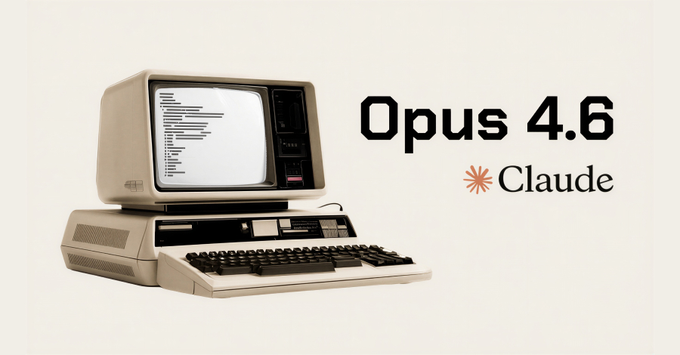
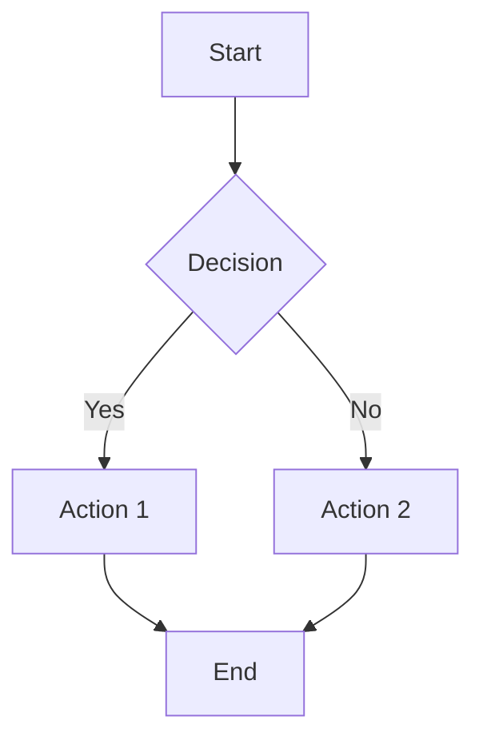
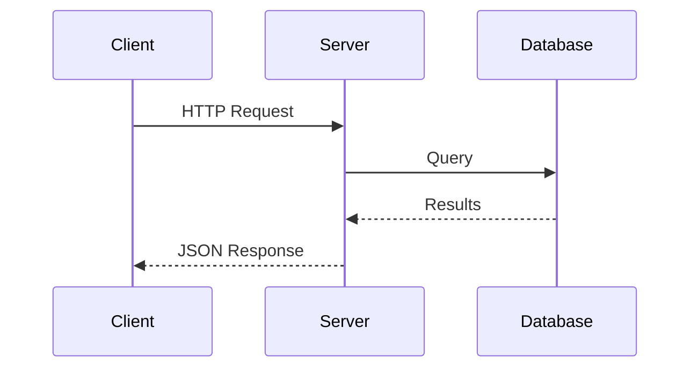

# Ostendo Feature Test
<!-- section: intro -->
<!-- timing: 0.5 -->
<!-- font_size: 4 -->

A systematic test of every rendering feature — one per slide.

- Navigate: arrow keys or h/l
- Help: press ?
- Quit: press q

<!-- notes:
FEATURE: Title slide + front matter
EXPECTED: Title in accent color (#00FFAA override from front matter), subtitle text, bullet list
VERIFY: Title renders bold in accent color, bullets have correct indent, front matter parsed (author/date visible in status bar)
TALKING POINTS:
- Welcome to the comprehensive Ostendo feature test
- This presentation tests ALL features including v0.2.0 additions
- Front matter includes: title, author, date, accent override, default alignment, global transition
- The accent color should be #00FFAA (teal-green) instead of the theme default
- Author "Ostendo QA" and date "2026-03-09" should appear in the status bar
- Press 'n' to toggle speaker notes, Shift+N/P to scroll notes
-->

---

<!-- ascii_title -->
# ASCII Art
<!-- section: formatting -->
<!-- timing: 0.5 -->
<!-- font_size: 4 -->

This title should render as large FIGlet ASCII art

<!-- notes:
FEATURE: ASCII art title
EXPECTED: Title "ASCII Art" renders in FIGlet slant font using accent color
VERIFY: Large multi-line ASCII characters visible, not plain text
-->

---

# Bullet Depths
<!-- section: formatting -->
<!-- timing: 0.5 -->
<!-- font_size: 4 -->

- Top level bullet (depth 0, accent marker)
- Another top level
  - Second level indent (depth 1)
  - Another second level
    - Third level deep (depth 2)
    - Another deep bullet
- Back to top level

<!-- notes:
FEATURE: Bullet depth levels
EXPECTED: Three distinct indent levels with different bullet markers
VERIFY: Level 0 (*), level 1 (-), level 2 (>) at increasing indents
-->

---

# Bold Text
<!-- section: formatting -->
<!-- timing: 0.5 -->
<!-- font_size: 4 -->

- This line has **bold text** inline
- **Entire line is bold**
- Normal text then **bold at end**

<!-- notes:
FEATURE: Bold text
EXPECTED: Double-asterisk text renders with bold attribute
VERIFY: Bold text appears brighter/heavier than normal text
-->

---

# Italic Text
<!-- section: formatting -->
<!-- timing: 0.5 -->
<!-- font_size: 4 -->

- This line has *italic text* inline
- *Entire line is italic*
- Normal text then *italic at end*

<!-- notes:
FEATURE: Italic text
EXPECTED: Single-asterisk text renders with italic attribute
VERIFY: Italic text appears slanted (terminal-dependent)
-->

---

# Strikethrough Text
<!-- section: formatting -->
<!-- timing: 0.5 -->
<!-- font_size: 4 -->

- This line has ~~strikethrough text~~ inline
- ~~Entire line is struck through~~
- Normal text then ~~strikethrough at end~~

<!-- notes:
FEATURE: Strikethrough text
EXPECTED: Double-tilde text renders with strikethrough attribute
VERIFY: Strikethrough line visible through text (terminal-dependent)
-->

---

# Inline Code
<!-- section: formatting -->
<!-- timing: 0.5 -->
<!-- font_size: 4 -->

- This line has `inline code` with background
- `Code at start` of line
- Normal text then `code at end`

<!-- notes:
FEATURE: Inline code
EXPECTED: Backtick text renders with code_bg background color
VERIFY: Code spans have visible background distinct from page background
-->

---

# Mixed Inline Formatting
<!-- section: formatting -->
<!-- timing: 0.5 -->
<!-- font_size: 4 -->

- **Bold** and *italic* and `code` together
- **Bold *and italic* mixed** in one span
- Text with ~~strike~~ and **bold** and `code`

<!-- notes:
FEATURE: Mixed inline formatting
EXPECTED: Multiple formatting types coexist on same line
VERIFY: Each format type renders correctly without bleeding into others
-->

---

# Subtitle Display
<!-- section: formatting -->
<!-- timing: 0.5 -->
<!-- font_size: 4 -->

This line is the subtitle — the first non-directive non-empty line after the title

- The subtitle appears dimmer than regular content
- Inline formatting in subtitles: **bold** and *italic* work

<!-- notes:
FEATURE: Subtitle extraction
EXPECTED: "This line is the subtitle..." renders as subtitle (slightly dimmer)
VERIFY: Subtitle text is visible between title and bullets, dimmer than bullet text
-->

---

# Executable Code: Python
<!-- section: code -->
<!-- timing: 0.5 -->
<!-- font_size: 4 -->

```python +exec {label: "hello.py"}
import sys
print("Hello from Ostendo!")
print(f"Python {sys.version_info.major}.{sys.version_info.minor}")
```

- Press Ctrl+E to execute
- Output streams below the code block

<!-- notes:
FEATURE: Executable code block (+exec)
EXPECTED: Code block with +exec marker, Ctrl+E executes and shows output
VERIFY: +exec badge visible, execution produces output below code block
-->

---

# Code Block: Python
<!-- section: code -->
<!-- timing: 0.5 -->
<!-- font_size: 4 -->

```python +exec {label: "fibonacci.py"}
def fibonacci(n):
    """Generate Fibonacci sequence."""
    a, b = 0, 1
    for _ in range(n):
        yield a
        a, b = b, a + b

for num in fibonacci(8):
    print(num, end=" ")
```

<!-- notes:
FEATURE: Code block with syntax highlighting + label
EXPECTED: Python code with colored keywords, strings, comments in a bordered box
VERIFY: def/for/print colored differently, label "fibonacci.py" visible above code
-->

---

# Executable Code: Bash
<!-- section: code -->
<!-- timing: 0.5 -->
<!-- font_size: 4 -->

```bash +exec {label: "system_info.sh"}
echo "User: $(whoami)"
echo "Shell: $SHELL"
echo "Date: $(date +%Y-%m-%d)"
echo "PWD: $(pwd)"
```

<!-- notes:
FEATURE: Bash code execution
EXPECTED: Bash script executes with Ctrl+E, shows system info
VERIFY: Output displays user, shell, date, and working directory
-->

---

# Executable Code: Ruby
<!-- section: code -->
<!-- timing: 0.5 -->
<!-- font_size: 4 -->

```ruby +exec {label: "ruby_demo.rb"}
puts "Hello from Ruby!"
puts "Ruby version: #{RUBY_VERSION}"
3.times { |i| puts "  Count: #{i + 1}" }
```

<!-- notes:
FEATURE: Ruby code execution (v0.2.0)
EXPECTED: Ruby code executes via `ruby -e`
VERIFY: Ruby output visible with version and count loop
-->

---

# Code Block: Rust
<!-- section: code -->
<!-- timing: 0.5 -->
<!-- font_size: 4 -->

```rust +exec {label: "example.rs"}
fn main() {
    let numbers: Vec<i32> = (1..=5).collect();
    let sum: i32 = numbers.iter().sum();
    println!("Numbers: {:?}", numbers);
    println!("Sum: {}", sum);
}
```

<!-- notes:
FEATURE: Rust syntax highlighting + execution
EXPECTED: Rust code with colored keywords (fn, let), types (Vec, i32), macros (println!)
VERIFY: Syntax highlighting applies correctly for Rust, Ctrl+E executes
-->

---

# Rust Auto-Wrap (No Main)
<!-- section: code -->
<!-- timing: 0.5 -->
<!-- font_size: 4 -->

```rust +exec {label: "auto_wrap.rs"}
let mut fib = vec![0u64, 1];
for i in 2..15 {
    let next = fib[i - 1] + fib[i - 2];
    fib.push(next);
}
println!("Fibonacci: {:?}", fib);

fn is_even(n: u64) -> bool {
    n % 2 == 0
}

let even_fibs: Vec<&u64> = fib.iter().filter(|n| is_even(**n)).collect();
println!("Even Fibonacci numbers: {:?}", even_fibs);
```

- No `fn main()` needed — Ostendo auto-wraps bare Rust code
- Helper functions like `is_even()` are extracted and placed outside main
- Press **Ctrl+E** to execute

<!-- notes:
FEATURE: Rust auto-wrap execution (v0.2.1)
EXPECTED: Bare Rust code without fn main() executes successfully via auto-wrapping
VERIFY: Ctrl+E executes, output shows Fibonacci sequence and filtered even numbers
-->

---

# Code Block: Go
<!-- section: code -->
<!-- timing: 0.5 -->
<!-- font_size: 4 -->

```go +exec {label: "main.go"}
package main

import "fmt"

func main() {
    fruits := []string{"apple", "banana", "cherry"}
    for i, f := range fruits {
        fmt.Printf("%d: %s\n", i, f)
    }
}
```

<!-- notes:
FEATURE: Go syntax highlighting + execution
EXPECTED: Go code with syntax highlighting, executable with Ctrl+E
VERIFY: Go keywords colored correctly (package, import, func, for, range)
-->

---

# Go Auto-Wrap (No Main)
<!-- section: code -->
<!-- timing: 0.5 -->
<!-- font_size: 4 -->

```go +exec {label: "auto_wrap.go"}
for i := 1; i <= 20; i++ {
    switch {
    case i%15 == 0:
        fmt.Println("FizzBuzz")
    case i%3 == 0:
        fmt.Println("Fizz")
    case i%5 == 0:
        fmt.Println("Buzz")
    default:
        fmt.Println(i)
    }
}
```

- No `package main` / `func main()` needed — auto-wrapped
- Package imports (`fmt`) are detected automatically
- Press **Ctrl+E** to execute

<!-- notes:
FEATURE: Go auto-wrap execution (v0.2.1)
EXPECTED: Bare Go code without package/func main executes via auto-wrapping
VERIFY: Ctrl+E executes, output shows FizzBuzz sequence 1-20
-->

---

# Code Block: C
<!-- section: code -->
<!-- timing: 0.5 -->
<!-- font_size: 4 -->

```c +exec {label: "hello.c"}
#include <stdio.h>

int main() {
    int nums[] = {1, 2, 3, 4, 5};
    int sum = 0;
    for (int i = 0; i < 5; i++) {
        sum += nums[i];
    }
    printf("Sum: %d\n", sum);
    return 0;
}
```

<!-- notes:
FEATURE: C syntax highlighting + execution
EXPECTED: C code with syntax highlighting, executable with cc/gcc/clang
VERIFY: C keywords colored correctly (#include, int, for, return), Ctrl+E executes
-->

---

# C Auto-Wrap (No Main)
<!-- section: code -->
<!-- timing: 0.5 -->
<!-- font_size: 4 -->

```c +exec {label: "auto_wrap.c"}
int factorial(int n) {
    if (n <= 1) return 1;
    return n * factorial(n - 1);
}

for (int i = 1; i <= 10; i++) {
    printf("%d! = %d\n", i, factorial(i));
}
```

- No `int main()` needed — auto-wrapped with standard includes
- Custom functions like `factorial()` are extracted before main
- Press **Ctrl+E** to execute

<!-- notes:
FEATURE: C auto-wrap execution (v0.2.1)
EXPECTED: Bare C code with helper function executes via auto-wrapping
VERIFY: Ctrl+E executes, output shows factorials 1-10
-->

---

# Code Block: C++
<!-- section: code -->
<!-- timing: 0.5 -->
<!-- font_size: 4 -->

```cpp +exec {label: "demo.cpp"}
#include <iostream>
#include <vector>
#include <algorithm>

int main() {
    std::vector<int> v = {5, 3, 1, 4, 2};
    std::sort(v.begin(), v.end());
    for (auto x : v) {
        std::cout << x << " ";
    }
    std::cout << std::endl;
    return 0;
}
```

<!-- notes:
FEATURE: C++ syntax highlighting + execution
EXPECTED: C++ code with syntax highlighting, executable with Ctrl+E
VERIFY: C++ keywords and STL types highlighted correctly
-->

---

# Code Block: JavaScript
<!-- section: code -->
<!-- timing: 0.5 -->
<!-- font_size: 4 -->

```javascript +exec {label: "async_demo.js"}
const greet = (name) => `Hello, ${name}!`;
console.log(greet("Ostendo"));
console.log("Array:", [1, 2, 3].map(x => x * 2));
```

<!-- notes:
FEATURE: JavaScript code execution
EXPECTED: JS code executes via node -e
VERIFY: Console output shows greeting and mapped array
-->

---

# Multiple Code Blocks
<!-- section: code -->
<!-- timing: 0.5 -->
<!-- font_size: 4 -->

```rust +exec {label: "example.rs"}
fn main() {
    println!("Hello, Rust!");
}
```

```bash +exec {label: "usage.sh"}
cargo run
ostendo --help
```

<!-- notes:
FEATURE: Multiple code blocks on one slide
EXPECTED: Two separate code blocks with different languages and labels
VERIFY: Both blocks render with correct syntax highlighting and labels
-->

---

# PTY Mode Code Block
<!-- section: code -->
<!-- timing: 0.5 -->
<!-- font_size: 4 -->

```bash +pty {label: "interactive.sh"}
echo "This runs in a PTY"
```

- The `+pty` flag spawns code in a pseudo-terminal
- Useful for interactive programs like `htop`, `vim`, etc.
- Press Ctrl+E to execute

<!-- notes:
FEATURE: PTY mode code execution (+pty)
EXPECTED: Code block shows +pty badge, executes in pseudo-terminal
VERIFY: +pty badge visible, execution uses PTY instead of simple subprocess
-->

---

# Code Preamble
<!-- section: code -->
<!-- timing: 0.5 -->
<!-- font_size: 4 -->

<!-- preamble_start: python -->
import math
PI = math.pi
<!-- preamble_end -->

```python +exec {label: "use_preamble.py"}
# math and PI are available from the preamble
print(f"Pi = {PI:.6f}")
print(f"Tau = {PI * 2:.6f}")
print(f"sqrt(2) = {math.sqrt(2):.6f}")
```

- The preamble defines `import math` and `PI` for this slide
- Preamble code is prepended before execution

<!-- notes:
FEATURE: Code preamble directives (v0.2.0)
EXPECTED: Preamble code (import math, PI = math.pi) is prepended to the code block before execution
VERIFY: Ctrl+E executes successfully — PI and math are available without being in the visible code
-->

---

# Basic Table
<!-- section: tables -->
<!-- timing: 0.5 -->
<!-- font_size: 4 -->

| Feature | Status | Notes |
| --- | --- | --- |
| Bullets | Done | All depths |
| Code | Done | Syntax highlighting |
| Tables | Done | With borders |
| Images | Done | Multi-protocol |
| Columns | Done | 2 and 3 col |

<!-- notes:
FEATURE: Basic table
EXPECTED: Table with box-drawing borders, header row bold/accented
VERIFY: Columns aligned, borders use box chars
-->

---

# Table Alignment
<!-- section: tables -->
<!-- timing: 0.5 -->
<!-- font_size: 4 -->

| Left Aligned | Center Aligned | Right Aligned |
| :--- | :---: | ---: |
| alpha | bravo | charlie |
| delta | echo | foxtrot |
| golf | hotel | india |

<!-- notes:
FEATURE: Table column alignment
EXPECTED: Left/center/right alignment per column header markers
VERIFY: Left col left-aligned, center col centered, right col right-aligned
-->

---

# Short Blockquote
<!-- section: quotes -->
<!-- timing: 0.5 -->
<!-- font_size: 4 -->

> The only truly secure system is one that is powered off.
> -- Gene Spafford

<!-- notes:
FEATURE: Short blockquote
EXPECTED: Text with left border pipe in accent color, italic text
VERIFY: border visible in accent color, text is italic
-->

---

# Long Blockquote (Wrapping)
<!-- section: quotes -->
<!-- timing: 0.5 -->
<!-- font_size: 4 -->

> This is a very long blockquote line that should wrap automatically at the terminal width boundary while maintaining the left border pipe character and proper indentation throughout the wrapped lines to test the text wrapping functionality

<!-- notes:
FEATURE: Long blockquote with text wrapping
EXPECTED: Long text wraps at terminal width, each wrapped line has the border prefix
VERIFY: No horizontal truncation, all wrapped lines show border
-->

---

# Blockquote with Formatting
<!-- section: quotes -->
<!-- timing: 0.5 -->
<!-- font_size: 4 -->

> This quote has **bold text** and *italic text* and `inline code` mixed in

> A second blockquote below the first

<!-- notes:
FEATURE: Blockquote with inline formatting + multiple blockquotes
EXPECTED: Bold, italic, code formatting visible within blockquote; two separate quotes
VERIFY: Formatting renders inside blockquote, both quotes show borders
-->

---

# Two Equal Columns
<!-- section: columns -->
<!-- timing: 0.5 -->
<!-- font_size: 4 -->

<!-- column_layout: [1, 1] -->

<!-- column: 0 -->
- Left column item 1
- Left column item 2
- Left column item 3

<!-- column: 1 -->
- Right column item 1
- Right column item 2
- Right column item 3

<!-- reset_layout -->

<!-- notes:
FEATURE: Two equal columns [1, 1]
EXPECTED: Content split into two equal-width columns
VERIFY: Left and right columns render side by side with equal width
-->

---

# Asymmetric Columns (2:1)
<!-- section: columns -->
<!-- timing: 0.5 -->
<!-- font_size: 4 -->

<!-- column_layout: [2, 1] -->

<!-- column: 0 -->
- This wider column gets 2/3 width
- Good for main content
- Has more space for longer text

<!-- column: 1 -->
- Narrow 1/3
- Sidebar info
- Compact

<!-- reset_layout -->

<!-- notes:
FEATURE: Asymmetric columns (2:1 ratio)
EXPECTED: Left column is approximately twice as wide as right column
VERIFY: Width ratio visually ~2:1, content doesn't overflow
-->

---

# Three Columns
<!-- section: columns -->
<!-- timing: 0.5 -->
<!-- font_size: 4 -->

<!-- column_layout: [1, 1, 1] -->

<!-- column: 0 -->
- Col 1 A
- Col 1 B

<!-- column: 1 -->
- Col 2 A
- Col 2 B

<!-- column: 2 -->
- Col 3 A
- Col 3 B

<!-- reset_layout -->

<!-- notes:
FEATURE: Three column layout [1, 1, 1]
EXPECTED: Content split into three equal-width columns
VERIFY: Three columns render side by side, none overlap
-->

---

# Columns with Code
<!-- section: columns -->
<!-- timing: 0.5 -->
<!-- font_size: 4 -->

<!-- column_layout: [3, 2] -->

<!-- column: 0 -->

```python +exec {label: "col_exec.py"}
import math
print(f"Pi = {math.pi:.4f}")
print(f"e  = {math.e:.4f}")
```

<!-- column: 1 -->
- Code in columns
- +exec badge visible
- Ctrl+E to execute
- Output streams below

<!-- reset_layout -->

<!-- notes:
FEATURE: Columns with code block (3:2 ratio)
EXPECTED: Code block renders within column bounds, executable
VERIFY: Code block fits in left column, right column has bullets
-->

---

# Wide Asymmetric Columns (3:1)
<!-- section: columns -->
<!-- timing: 0.5 -->
<!-- font_size: 4 -->

<!-- column_layout: [3, 1] -->

<!-- column: 0 -->
- This column is 75% width
- Great for main content with a narrow sidebar
- The wider column dominates the layout

<!-- column: 1 -->
- 25% sidebar
- Compact

<!-- reset_layout -->

<!-- notes:
FEATURE: Wide asymmetric columns (3:1 ratio)
EXPECTED: Left column ~75%, right column ~25%
VERIFY: Content renders proportionally
-->

---

# Image: Auto Protocol
<!-- section: images -->
<!-- timing: 0.5 -->
<!-- font_size: 4 -->



<!-- notes:
FEATURE: Image with auto protocol detection
EXPECTED: Image renders using detected protocol (Kitty/iTerm2/Sixel/ASCII)
VERIFY: Image visible, not garbled, correct aspect ratio
-->

---

# Image: SVG Rendering
<!-- section: images -->
<!-- timing: 0.5 -->
<!-- font_size: 4 -->


<!-- image_scale: 50 -->

<!-- notes:
FEATURE: SVG image rendering
EXPECTED: SVG logo rasterized and rendered using detected protocol
VERIFY: SVG renders cleanly, no artifacts, correct aspect ratio
-->

---

# Image: ASCII Art (PNG)
<!-- section: images -->
<!-- timing: 0.5 -->
<!-- font_size: 4 -->
<!-- image_render: ascii -->


- Forced ASCII mode via `<!-- image_render: ascii -->` directive

<!-- notes:
FEATURE: Image ASCII rendering mode override
EXPECTED: Image renders using ASCII characters regardless of terminal support
VERIFY: Recognizable image shape in ASCII chars
-->

---

# Image: ASCII Art (SVG)
<!-- section: images -->
<!-- timing: 0.5 -->
<!-- font_size: 4 -->
<!-- image_render: ascii -->


<!-- image_scale: 60 -->

- SVG rendered as ASCII art

<!-- notes:
FEATURE: SVG image in ASCII rendering mode
EXPECTED: SVG rasterized then rendered as ASCII characters
VERIFY: Recognizable shape, clean rendering from SVG source
-->

---

# ASCII Art + Sparkle
<!-- section: v0.2.0 -->
<!-- timing: 0.5 -->
<!-- font_size: 4 -->
<!-- image_render: ascii -->
<!-- loop_animation: sparkle -->


- ASCII art image with twinkling star sparkles
- Random cells flash as ✦ ★ ✧ characters

<!-- notes:
FEATURE: ASCII art image with sparkle animation (v0.2.1)
EXPECTED: DakotaCon logo rendered as ASCII art with random cells twinkling as star characters
VERIFY: ASCII art visible, sparkle stars appear and disappear across the image
-->

---

# ASCII Art + Spin
<!-- section: v0.2.0 -->
<!-- timing: 0.5 -->
<!-- font_size: 4 -->
<!-- image_render: ascii -->
<!-- loop_animation: spin -->


- ASCII art image with spinning/morphing characters
- Characters cycle through the ASCII brightness ramp in waves

<!-- notes:
FEATURE: ASCII art image with spin animation (v0.2.1)
EXPECTED: DakotaCon logo rendered as ASCII art with characters shimmering/morphing
VERIFY: ASCII art visible, characters shift through ramp values creating wave effect
-->

---

# Image: Scaled
<!-- section: images -->
<!-- timing: 0.5 -->
<!-- font_size: 4 -->


<!-- image_scale: 30 -->

- Image scaled to 30% via `<!-- image_scale: 30 -->`

<!-- notes:
FEATURE: Image scale directive
EXPECTED: Image renders at 30% of available space
VERIFY: Image is noticeably smaller than default (100%) rendering
-->

---

# Image: Color Override
<!-- section: images -->
<!-- timing: 0.5 -->
<!-- font_size: 4 -->
<!-- image_color: #FF5500 -->
<!-- image_render: ascii -->


- ASCII art rendered with color override via `<!-- image_color: #FF5500 -->`
- All image characters use the specified color instead of source colors

<!-- notes:
FEATURE: Image color override directive
EXPECTED: DakotaCon ASCII art rendered entirely in orange (#FF5500)
VERIFY: All characters in the ASCII art use the overridden color
-->

---

<!-- font_size: 5 -->
# Font Size Directive
<!-- section: display -->
<!-- timing: 0.5 -->

This slide uses `<!-- font_size: 5 -->` directive (+8pt offset)

- Font size only changes in Kitty terminal (OSC 66)
- In other terminals, this has no visible effect
- Use `]` and `[` keys to adjust (Kitty only)

<!-- notes:
FEATURE: Font size directive
EXPECTED: In Kitty: larger font. In other terminals: no visible change (graceful degradation)
VERIFY: No errors regardless of terminal, slide renders normally
-->

---

# Section Transition
<!-- section: sections -->
<!-- timing: 0.5 -->
<!-- font_size: 4 -->

- This slide starts a new section: "sections"
- Section name appears in status bar area
- Use J/K to jump between sections

<!-- notes:
FEATURE: Section transitions and section navigation
EXPECTED: Section label "sections" visible, J/K navigate between sections
VERIFY: Section name shows in slide content, J/K skip to next/prev section
-->

---

# Speaker Notes
<!-- section: display -->
<!-- timing: 0.5 -->
<!-- font_size: 4 -->

- Press `n` to toggle the notes panel
- Notes appear at the bottom of the screen
- Shift+N scrolls notes down, Shift+P scrolls up

<!-- notes:
FEATURE: Speaker notes panel with scrolling
EXPECTED: Pressing 'n' shows notes panel at bottom with consistent background color
VERIFY: Notes panel fills entire bottom area, background covers all rows
TALKING POINTS:
- Press 'n' to toggle the notes panel visibility
- The notes panel occupies 7 rows at the bottom of the screen
- The separator line shows "Notes" with a scroll indicator if content overflows
- Press Shift+N to scroll notes down, Shift+P to scroll notes up
- The notes background should fill the ENTIRE reserved area
- Notes scroll position resets when changing slides
- This is line 8 of the notes
- This is line 9 — testing notes scrolling
- This is line 10 — if you can see this, notes scrolling works correctly
- This is line 11
- This is line 12
-->

---

# Timing
<!-- section: display -->
<!-- timing: 2.0 -->
<!-- font_size: 4 -->

- This slide has 2.0 minute timing set
- Timer starts on first slide navigation
- Timer shows in status bar as HH:MM:SS
- Use `:timer` to start, `:timer reset` to reset

<!-- notes:
FEATURE: Slide timing
EXPECTED: Timer visible in status bar, timing directive parsed
VERIFY: Timer counts up in status bar after navigating slides
-->

---

# Theme Switching
<!-- section: display -->
<!-- timing: 0.5 -->
<!-- font_size: 4 -->

- Use `:theme <slug>` to switch themes live
- Try: `:theme dracula` or `:theme cyberpunk`
- All colors update immediately
- Use `--list-themes` CLI flag to see all 23 themes

Available themes:
- `terminal_green`, `dracula`, `nord`, `catppuccin`, `cyber_red`
- `frost_glass`, `neon_purple`, `outrun`, `vaporwave`, `matrix`
- `solarized`, `sunset_warm`, `arctic_blue`, `blood_moon`, `blueprint`
- `clean_light`, `paper`, `minimal_mono`, `military_green`, `amber_warning`
- `dracula_light`, `nord_light`, `terminal_green_light`

<!-- notes:
FEATURE: Theme switching via :theme command
EXPECTED: :theme command changes all colors (bg, text, accent, code_bg)
VERIFY: Colors change after :theme command, no rendering artifacts
-->

---

# Scale Adjustment
<!-- section: display -->
<!-- timing: 0.5 -->
<!-- font_size: 4 -->

- Press `+` to increase content scale
- Press `-` to decrease content scale
- Default scale: 80%
- Range: 50% to 200%
- Use `>` / `<` for fine-grained adjustment
- Ctrl+0 resets to default
- Image scale: `>` increases, `<` decreases image size


<!-- notes:
FEATURE: Content scale adjustment
EXPECTED: +/- keys change content width with visible margin changes
VERIFY: Content area widens/narrows, margins adjust symmetrically
-->

---

# Fullscreen Mode
<!-- section: display -->
<!-- timing: 0.5 -->
<!-- font_size: 4 -->

- Press `f` to toggle fullscreen mode
- Fullscreen hides the status bar
- Maximizes content area
- Also available via `--fullscreen` CLI flag

<!-- notes:
FEATURE: Fullscreen mode toggle
EXPECTED: Pressing 'f' hides the status bar and gives more content space
VERIFY: Status bar disappears, content area expands to fill screen
-->

---

# Font Size Keybindings (Kitty)
<!-- section: display -->
<!-- timing: 0.5 -->
<!-- font_size: 4 -->

- Press `]` to increase font size (+2pt per press)
- Press `[` to decrease font size (-2pt per press)
- Press `Ctrl+0` to reset font size to slide default
- Only works in **Kitty terminal** (OSC 66 protocol)
- Other terminals: no visible effect (graceful degradation)

<!-- notes:
FEATURE: Font size keybinding adjustment (Kitty only)
EXPECTED: ] increases, [ decreases, Ctrl+0 resets font size in Kitty
VERIFY: Font size changes visually in Kitty; no crash in other terminals
-->

---

# Image Scale Keybindings
<!-- section: display -->
<!-- timing: 0.5 -->
<!-- font_size: 4 -->

- On slides with images, press `>` to enlarge
- Press `<` to shrink the image
- Adjusts image_scale at runtime (cached per scale)
- Independent from global content scale (`+` / `-`)

<!-- notes:
FEATURE: Runtime image scale adjustment via > and < keys
EXPECTED: > enlarges image, < shrinks it, without lag
VERIFY: Image resizes on keypress, separate from content scale
-->

---

# Mouse & Scroll Support
<!-- section: display -->
<!-- timing: 0.5 -->
<!-- font_size: 4 -->

- **Mouse wheel** scrolls content up/down (3 lines per tick)
- **j/k** or **Up/Down** arrows scroll 1 line
- **Ctrl+D / Ctrl+U** scrolls half-page
- Scrolling only active when content overflows the viewport
- Mouse events are captured in raw mode

<!-- notes:
FEATURE: Mouse scroll and keyboard scroll support
EXPECTED: Mouse wheel scrolls content, keyboard scrolling works on long slides
VERIFY: Test on a scroll-required slide, mouse wheel and keys both scroll
-->

---

# Overview Mode
<!-- section: display -->
<!-- timing: 0.5 -->
<!-- font_size: 4 -->

- Press `:overview` or `o` to enter overview mode
- Shows all slide titles in a two-column layout
- Navigate with j/k or arrows, Enter to jump
- Press `o` or Esc to exit overview

<!-- notes:
FEATURE: Overview mode
EXPECTED: :overview command shows all slide titles in a navigable list
VERIFY: Overview shows slide numbers and titles, allows jumping
-->

---

# Help Screen
<!-- section: display -->
<!-- timing: 0.5 -->
<!-- font_size: 4 -->

- Press `?` to show the help screen
- Shows all keybindings and commands
- Press Esc to return to normal mode

<!-- notes:
FEATURE: Help screen
EXPECTED: ? key shows all available keybindings
VERIFY: Help screen is readable, shows navigation, commands, and special keys
-->

---

# Goto Slide
<!-- section: display -->
<!-- timing: 0.5 -->
<!-- font_size: 4 -->

- Press `g` then type a slide number and Enter
- Also available via `:goto N` command
- Jumps directly to the specified slide

<!-- notes:
FEATURE: Goto slide (g key and :goto command)
EXPECTED: g enters goto mode, typing number + Enter jumps to that slide
VERIFY: Goto mode shows prompt, jumping works correctly
-->

---

# Command Mode
<!-- section: display -->
<!-- timing: 0.5 -->
<!-- font_size: 4 -->

- Press `:` to enter command mode
- Available commands:
  - `:theme <slug>` — switch theme
  - `:goto N` — jump to slide N
  - `:notes` — toggle notes
  - `:timer` / `:timer reset` — start/reset timer
  - `:overview` — overview mode
  - `:help` — help screen
  - `:reload` — reload presentation file

<!-- notes:
FEATURE: Command mode (:)
EXPECTED: : key opens command prompt, all listed commands work
VERIFY: Command prompt visible at bottom, each command executes correctly
-->

---

# Hot Reload
<!-- section: display -->
<!-- timing: 0.5 -->
<!-- font_size: 4 -->

- Edit the markdown file while presenting
- Changes auto-reload every 500ms
- Also available via `:reload` command
- Slide position is preserved during reload

<!-- notes:
FEATURE: Hot reload via file watcher
EXPECTED: Editing the source file auto-updates the presentation
VERIFY: Changes to markdown reflect in real-time without restarting
-->

---

# Per-Slide Footer
<!-- section: v0.2.0 -->
<!-- timing: 0.5 -->
<!-- font_size: 4 -->
<!-- footer: Footer — Left Aligned (default) -->

- Custom footer bar rendered at the bottom of the screen
- Uses theme background color, not status bar background
- Default alignment is left: `<!-- footer_align: left -->`

<!-- notes:
FEATURE: Per-slide footer directive with left alignment (v0.2.0)
EXPECTED: "Footer — Left Aligned (default)" at bottom-left of screen with theme bg
VERIFY: Footer bar at bottom with text left-aligned, theme background color
-->

---

# Footer: Center Aligned
<!-- section: v0.2.0 -->
<!-- timing: 0.5 -->
<!-- font_size: 4 -->
<!-- footer: ✦ Centered Footer ✦ -->
<!-- footer_align: center -->

- Footer text is centered at the bottom of the screen
- Set via `<!-- footer_align: center -->` directive

<!-- notes:
FEATURE: Per-slide footer with center alignment (v0.2.0)
EXPECTED: "✦ Centered Footer ✦" centered at bottom of screen
VERIFY: Footer bar at bottom with text centered
-->

---

# Footer: Right Aligned
<!-- section: v0.2.0 -->
<!-- timing: 0.5 -->
<!-- font_size: 4 -->
<!-- footer: Right-Aligned Footer → -->
<!-- footer_align: right -->

- Footer text is right-aligned at the bottom of the screen
- Set via `<!-- footer_align: right -->` directive

<!-- notes:
FEATURE: Per-slide footer with right alignment (v0.2.0)
EXPECTED: "Right-Aligned Footer →" right-aligned at bottom of screen
VERIFY: Footer bar at bottom with text right-aligned
-->

---

# Vertical Centering
<!-- section: v0.2.0 -->
<!-- timing: 0.5 -->
<!-- font_size: 4 -->
<!-- align: center -->

- This content is vertically centered
- Using `<!-- align: center -->` directive
- Content floats in the middle of the screen

<!-- notes:
FEATURE: Per-slide vertical alignment (v0.2.0)
EXPECTED: Content is vertically centered in the available space
VERIFY: Empty space above and below content is roughly equal
-->

---

# VCenter Only
<!-- section: v0.2.0 -->
<!-- timing: 0.5 -->
<!-- font_size: 4 -->
<!-- align: vcenter -->

- Vertically centered only (left-aligned horizontally)
- Using `<!-- align: vcenter -->` directive
- Content stays at normal left margin

<!-- notes:
FEATURE: Per-slide vertical-only centering (v0.2.0)
EXPECTED: Content vertically centered but left-aligned
VERIFY: Equal space above/below, text at normal left margin
-->

---

# HCenter Only
<!-- section: v0.2.0 -->
<!-- timing: 0.5 -->
<!-- font_size: 4 -->
<!-- align: hcenter -->

- Horizontally centered only (top-aligned vertically)
- Using `<!-- align: hcenter -->` directive
- Content starts at the top of the slide

<!-- notes:
FEATURE: Per-slide horizontal-only centering (v0.2.0)
EXPECTED: Content horizontally centered but top-aligned
VERIFY: Content centered horizontally, starts at top of slide
-->

---

# Accent Color Override
<!-- section: v0.2.0 -->
<!-- timing: 0.5 -->
<!-- font_size: 4 -->

- The accent color on this presentation is overridden to `#00FFAA`
- Set in front matter: `accent: "#00FFAA"`
- Persists across `:theme` switches
- Compare: default theme accent vs this presentation's teal-green (#00FFAA)
- The title, bullets, and progress bar should be teal-green, not the theme's default accent

<!-- notes:
FEATURE: Front matter accent color override (v0.2.0)
EXPECTED: Accent color is #00FFAA (teal-green) instead of theme default
VERIFY: Title, bullets, and accent elements use the overridden color
-->

---

# Title Decoration: Underline
<!-- section: v0.2.0 -->
<!-- timing: 0.5 -->
<!-- font_size: 4 -->
<!-- title_decoration: underline -->

- Title has an underline decoration below it
- Set via `<!-- title_decoration: underline -->`
- Uses box-drawing characters

<!-- notes:
FEATURE: Title decoration — underline (v0.2.0)
EXPECTED: A horizontal line appears below the title
VERIFY: Line of characters visible under the title text
-->

---

# Title Decoration: Box
<!-- section: v0.2.0 -->
<!-- timing: 0.5 -->
<!-- font_size: 4 -->
<!-- title_decoration: box -->

- Title is enclosed in a box
- Set via `<!-- title_decoration: box -->`
- Uses box-drawing border characters

<!-- notes:
FEATURE: Title decoration — box (v0.2.0)
EXPECTED: Title is surrounded by a box made of box-drawing characters
VERIFY: Box border visible around the title text
-->

---

# Title Decoration: Banner
<!-- section: v0.2.0 -->
<!-- timing: 0.5 -->
<!-- font_size: 4 -->
<!-- title_decoration: banner -->

- Title has a banner background
- Set via `<!-- title_decoration: banner -->`
- Uses accent color as background

<!-- notes:
FEATURE: Title decoration — banner (v0.2.0)
EXPECTED: Title has a full-width accent-colored background strip
VERIFY: Title text appears on an accent-colored banner background
-->

---

# Title Decoration: None
<!-- section: v0.2.0 -->
<!-- timing: 0.5 -->
<!-- font_size: 4 -->
<!-- title_decoration: none -->

- Title has no decoration (explicit override)
- Set via `<!-- title_decoration: none -->`
- Useful to override a theme default

<!-- notes:
FEATURE: Title decoration — none (v0.2.0)
EXPECTED: Title renders plain without any decoration
VERIFY: No underline, box, or banner around the title
-->

---

# Light/Dark Toggle
<!-- section: v0.2.0 -->
<!-- timing: 0.5 -->
<!-- font_size: 4 -->

- Press `D` to toggle light/dark variant
- Works for themes with variants defined:
  - `terminal_green` has `terminal_green_light`
  - `dracula` has `dracula_light`
  - `nord` has `nord_light`
- Try: `:theme terminal_green` then press `D`

<!-- notes:
FEATURE: Light/dark theme variant toggle (v0.2.0)
EXPECTED: D key switches between dark and light variants of the current theme
VERIFY: Colors change to light variant, pressing D again returns to dark
-->

---

# Slide Transition: Fade
<!-- section: v0.2.0 -->
<!-- timing: 0.5 -->
<!-- font_size: 4 -->
<!-- transition: fade -->

- This slide uses a fade transition
- Set via `<!-- transition: fade -->`
- Also set globally in front matter: `transition: fade`
- Transition plays when navigating to/from this slide

<!-- notes:
FEATURE: Slide transition — fade (v0.2.0)
EXPECTED: Fade animation plays when entering this slide
VERIFY: Content fades in smoothly from background color
-->

---

# Slide Transition: Slide
<!-- section: v0.2.0 -->
<!-- timing: 0.5 -->
<!-- font_size: 4 -->
<!-- transition: slide -->

- This slide uses a slide-left transition
- Set via `<!-- transition: slide -->`
- Old content slides left, new content enters from right

<!-- notes:
FEATURE: Slide transition — slide left (v0.2.0)
EXPECTED: Content slides in from the right when entering this slide
VERIFY: Horizontal sliding animation plays smoothly
-->

---

# Slide Transition: Dissolve
<!-- section: v0.2.0 -->
<!-- timing: 0.5 -->
<!-- font_size: 4 -->
<!-- transition: dissolve -->

- This slide uses a dissolve transition
- Set via `<!-- transition: dissolve -->`
- Characters randomly switch from old to new content

<!-- notes:
FEATURE: Slide transition — dissolve (v0.2.0)
EXPECTED: Characters dissolve from old slide to new slide
VERIFY: Cells transition randomly from old to new content
-->

---

# Entrance Animation: Typewriter
<!-- section: v0.2.0 -->
<!-- timing: 0.5 -->
<!-- font_size: 4 -->
<!-- animation: typewriter -->

- Characters reveal left-to-right like typing
- Set via `<!-- animation: typewriter -->`
- Plays once on slide entry

<!-- notes:
FEATURE: Entrance animation — typewriter (v0.2.0)
EXPECTED: Content appears character by character from left to right
VERIFY: Typing effect visible on slide entry
-->

---

# Entrance Animation: Fade In
<!-- section: v0.2.0 -->
<!-- timing: 0.5 -->
<!-- font_size: 4 -->
<!-- animation: fade_in -->

- Content fades in from background color
- Set via `<!-- animation: fade_in -->`
- Interpolates foreground colors from bg to full

<!-- notes:
FEATURE: Entrance animation — fade in (v0.2.0)
EXPECTED: All content gradually fades in from invisible to full color
VERIFY: Smooth color transition from background to text colors
-->

---

# Entrance Animation: Slide Down
<!-- section: v0.2.0 -->
<!-- timing: 0.5 -->
<!-- font_size: 4 -->
<!-- animation: slide_down -->

- Lines reveal top-to-bottom
- Set via `<!-- animation: slide_down -->`
- Each line appears with a staggered delay

<!-- notes:
FEATURE: Entrance animation — slide down (v0.2.0)
EXPECTED: Lines appear one by one from top to bottom
VERIFY: Staggered reveal effect visible
-->

---

# Loop Animation: Matrix
<!-- section: v0.2.0 -->
<!-- timing: 0.5 -->
<!-- font_size: 4 -->
<!-- loop_animation: matrix -->

- Falling green characters in the background
- Set via `<!-- loop_animation: matrix -->`
- Runs continuously while on this slide

<!-- notes:
FEATURE: Loop animation — matrix (v0.2.0)
EXPECTED: Matrix-style falling green characters behind the content
VERIFY: Animated background with dim falling characters, content stays readable
-->

---

# FIGlet + Matrix Rain
<!-- section: v0.2.0 -->
<!-- timing: 0.5 -->
<!-- font_size: 4 -->
<!-- ascii_title -->
<!-- loop_animation: matrix -->

- FIGlet ASCII title with matrix rain background
- Green falling characters surround the title

<!-- notes:
FEATURE: FIGlet ASCII title with matrix loop animation (v0.2.1)
EXPECTED: Large ASCII art title text with matrix rain effect
VERIFY: FIGlet title visible, matrix rain animates in empty areas
-->

---

# FIGlet + Bounce
<!-- section: v0.2.0 -->
<!-- timing: 0.5 -->
<!-- font_size: 4 -->
<!-- ascii_title -->
<!-- loop_animation: bounce -->

- FIGlet ASCII title with bouncing ball animation
- The ball bounces across the screen over the content

<!-- notes:
FEATURE: FIGlet ASCII title with bounce loop animation (v0.2.1)
EXPECTED: Large ASCII art title text with bouncing ball overlay
VERIFY: FIGlet title visible, ball bounces around the screen
-->

---

# FIGlet + Pulse
<!-- section: v0.2.0 -->
<!-- timing: 0.5 -->
<!-- font_size: 4 -->
<!-- ascii_title -->
<!-- loop_animation: pulse -->

- FIGlet ASCII title with pulsing brightness
- Title brightness oscillates via sine wave

<!-- notes:
FEATURE: FIGlet ASCII title with pulse loop animation (v0.2.1)
EXPECTED: Large ASCII art title text that pulses between dim and bright
VERIFY: FIGlet title pulses, brightness oscillates smoothly
-->

---

# FIGlet + Sparkle
<!-- section: v0.2.0 -->
<!-- timing: 0.5 -->
<!-- font_size: 4 -->
<!-- ascii_title -->
<!-- loop_animation: sparkle -->

- FIGlet ASCII title with twinkling star sparkles
- Random characters flash as ✦ ★ ✧ stars

<!-- notes:
FEATURE: FIGlet ASCII title with sparkle loop animation (v0.2.1)
EXPECTED: Large ASCII art title text with random cells sparkling as stars
VERIFY: FIGlet title visible, sparkle stars twinkle across the title characters
-->

---

# FIGlet + Spin
<!-- section: v0.2.0 -->
<!-- timing: 0.5 -->
<!-- font_size: 4 -->
<!-- ascii_title -->
<!-- loop_animation: spin -->

- FIGlet ASCII title with spinning character waves
- Characters morph through the ASCII brightness ramp

<!-- notes:
FEATURE: FIGlet ASCII title with spin loop animation (v0.2.1)
EXPECTED: Large ASCII art title text with characters shimmering in wave patterns
VERIFY: FIGlet title visible, characters cycle through ramp creating wave effect
-->

---

# Loop Animation: Bounce
<!-- section: v0.2.0 -->
<!-- timing: 0.5 -->
<!-- font_size: 4 -->
<!-- loop_animation: bounce -->

- An element bounces around the screen edges
- Set via `<!-- loop_animation: bounce -->`
- DVD screensaver style animation

<!-- notes:
FEATURE: Loop animation — bounce (v0.2.0)
EXPECTED: A bouncing element moves around the screen
VERIFY: Element bounces off edges continuously
-->

---

# Loop Animation: Pulse
<!-- section: v0.2.0 -->
<!-- timing: 0.5 -->
<!-- font_size: 4 -->
<!-- loop_animation: pulse -->

- Title brightness oscillates via sine wave
- Set via `<!-- loop_animation: pulse -->`
- Creates a breathing/pulsing effect

<!-- notes:
FEATURE: Loop animation — pulse (v0.2.0)
EXPECTED: Title brightness cycles between dim and full brightness
VERIFY: Pulsing/breathing effect visible on the title
-->

---

# Loop Animation: Sparkle
<!-- section: v0.2.0 -->
<!-- timing: 0.5 -->
<!-- font_size: 4 -->
<!-- loop_animation: sparkle -->

- Random star characters ✦ ★ ✧ twinkle across content
- Set via `<!-- loop_animation: sparkle -->`
- Each cell sparkles at a different phase
- Works on any content: text, ASCII art, FIGlet titles

<!-- notes:
FEATURE: Loop animation — sparkle (v0.2.1)
EXPECTED: Random cells briefly flash as star/sparkle characters in bright colors
VERIFY: Twinkling effect visible across bullet text and title
-->

---

# Loop Animation: Spin
<!-- section: v0.2.0 -->
<!-- timing: 0.5 -->
<!-- font_size: 4 -->
<!-- loop_animation: spin -->

- ASCII characters cycle through the brightness ramp
- Set via `<!-- loop_animation: spin -->`
- Creates a shimmering/morphing wave effect
- Best on ASCII art images and FIGlet titles

<!-- notes:
FEATURE: Loop animation — spin (v0.2.1)
EXPECTED: Characters shift through adjacent ASCII ramp values in sine wave patterns
VERIFY: Text characters shimmer/morph, most visible on varied character content
-->

---

# Combined Animation
<!-- section: v0.2.0 -->
<!-- timing: 0.5 -->
<!-- font_size: 4 -->
<!-- animation: typewriter -->
<!-- loop_animation: pulse -->
<!-- transition: fade -->

- This slide combines all three animation types:
  - Entrance: typewriter (plays once on entry)
  - Loop: pulse (runs continuously)
  - Transition: fade (plays when navigating)

<!-- notes:
FEATURE: Combined entrance + loop + transition animations (v0.2.0)
EXPECTED: Fade transition on entry, typewriter reveal, then continuous pulse
VERIFY: All three animation types work together without conflicts
-->

---

# Animation Reference
<!-- section: v0.2.0 -->
<!-- timing: 0.5 -->
<!-- font_size: 4 -->
<!-- animation: slide_down -->

**Transitions** (play between slides):
- `<!-- transition: fade -->` — fade through background color
- `<!-- transition: slide -->` — old slides left, new enters right
- `<!-- transition: dissolve -->` — rows randomly swap old/new

**Entrance Animations** (play once on slide entry):
- `<!-- animation: typewriter -->` — characters reveal left-to-right
- `<!-- animation: fade_in -->` — content fades from bg to full color
- `<!-- animation: slide_down -->` — lines reveal top-to-bottom

**Loop Animations** (run continuously):
- `<!-- loop_animation: matrix -->` — falling green rain effect
- `<!-- loop_animation: bounce -->` — bouncing ball across screen
- `<!-- loop_animation: pulse -->` — title brightness oscillates
- `<!-- loop_animation: sparkle -->` — twinkling star sparkles ✦★✧
- `<!-- loop_animation: spin -->` — ASCII characters cycle/shimmer

**Global** (front matter): `transition: fade` applies to all slides

<!-- notes:
FEATURE: Animation reference slide (v0.2.1)
EXPECTED: Quick reference of all available animation directives
VERIFY: All animation types listed with their directive syntax
-->

---

# Mermaid Diagram
<!-- section: v0.2.0 -->
<!-- timing: 0.5 -->
<!-- font_size: 4 -->



- Mermaid diagrams render via `mmdc` CLI if available
- Falls back to showing source as code block if mmdc not installed

<!-- notes:
FEATURE: Mermaid diagram rendering (v0.2.0)
EXPECTED: If mmdc is installed: rendered diagram image. If not: source code shown as fallback
VERIFY: Either a rendered flowchart or mermaid source code is visible
-->

---

# Mermaid: Sequence Diagram
<!-- section: v0.2.0 -->
<!-- timing: 0.5 -->
<!-- font_size: 4 -->



<!-- notes:
FEATURE: Mermaid sequence diagram (v0.2.0)
EXPECTED: Rendered sequence diagram if mmdc available, source code otherwise
VERIFY: Diagram shows client-server-database interaction flow
-->

---

# Export Features
<!-- section: v0.2.0 -->
<!-- timing: 0.5 -->
<!-- font_size: 4 -->

- Export to HTML: `ostendo --export html presentation.md`
- Export to PDF: `ostendo --export pdf presentation.md`
- Custom output: `ostendo --export html -o output.html presentation.md`

Export details:
- **HTML**: Self-contained with embedded CSS, base64 images, keyboard nav JS
- **PDF**: Via headless Chrome or wkhtmltopdf

<!-- notes:
FEATURE: HTML and PDF export (v0.2.0)
EXPECTED: Informational slide about export capabilities
VERIFY: This slide documents the --export flag correctly
-->

---

# CLI Flags
<!-- section: reference -->
<!-- timing: 0.5 -->
<!-- font_size: 4 -->

| Flag | Description |
| :--- | :--- |
| `--theme` | Theme slug (default: terminal_green) |
| `--slide N` | Start at slide N |
| `--image-mode` | Force image protocol |
| `--list-themes` | List available themes |
| `--remote` | Enable WebSocket remote control |
| `--remote-port` | Remote control port (default: 8765) |
| `--validate` | Validate without running TUI |
| `--count` | Print slide count and exit |
| `--export-titles` | Print slide titles |
| `--detect-protocol` | Print image protocol |
| `--scale` | Content scale (50-200) |
| `--fullscreen` | Start fullscreen |
| `--timer` | Start with timer running |
| `--export` | Export to html or pdf |
| `-o` | Output path for export |

<!-- notes:
FEATURE: CLI flags reference
EXPECTED: Table listing all CLI flags
VERIFY: All flags match `ostendo --help` output
-->

---

# Keybindings Reference
<!-- section: reference -->
<!-- timing: 0.5 -->
<!-- font_size: 4 -->

| Key | Action |
| :--- | :--- |
| `h` / Left | Previous slide |
| `l` / Right / Space | Next slide |
| `j` / Down | Scroll down |
| `k` / Up | Scroll up |
| `J` | Next section |
| `K` | Previous section |
| `Ctrl+D` | Half-page down |
| `Ctrl+U` | Half-page up |
| `Ctrl+E` | Execute code block |
| `g` | Goto slide (type number) |
| `n` | Toggle notes |
| `N` / `P` | Scroll notes down/up |
| `f` | Toggle fullscreen |
| `T` | Toggle theme name display |
| `D` | Toggle light/dark variant |
| `+` / `-` | Scale up/down |
| `>` / `<` | Fine scale adjust |
| `]` / `[` | Font size up/down (Kitty) |
| `Ctrl+0` | Reset font size (Kitty) |
| `?` | Help screen |
| `:` | Command mode |
| `q` | Quit |

<!-- notes:
FEATURE: Keybindings reference
EXPECTED: Table listing all keybindings
VERIFY: All listed keybindings work as documented
-->

---

# Scroll Test: Bullets
<!-- section: scrolling -->
<!-- timing: 0.5 -->
<!-- font_size: 4 -->

This slide has enough content to require scrolling. Use j/k or arrow keys.

- Bullet 1: The quick brown fox jumps over the lazy dog
- Bullet 2: Pack my box with five dozen liquor jugs
- Bullet 3: How vexingly quick daft zebras jump
- Bullet 4: The five boxing wizards jump quickly
- Bullet 5: Jackdaws love my big sphinx of quartz
- Bullet 6: Lorem ipsum dolor sit amet, consectetur adipiscing elit
- Bullet 7: Sed do eiusmod tempor incididunt ut labore et dolore magna aliqua
- Bullet 8: Ut enim ad minim veniam, quis nostrud exercitation ullamco
- Bullet 9: Duis aute irure dolor in reprehenderit in voluptate velit
- Bullet 10: Excepteur sint occaecat cupidatat non proident
  - Nested 10a: First nested item under bullet 10
  - Nested 10b: Second nested item under bullet 10
    - Deep 10b-i: Third level nesting test
    - Deep 10b-ii: Another third level item
- Bullet 11: Sunt in culpa qui officia deserunt mollit anim id est laborum
- Bullet 12: Curabitur pretium tincidunt lacus
- Bullet 13: Nulla gravida orci a odio
- Bullet 14: Nullam varius, turpis et commodo pharetra
- Bullet 15: Est eros bibendum elit, nec luctus magna felis sollicitudin mauris
- Bullet 16: Integer in mauris eu nibh euismod gravida
- Bullet 17: Duis ac tellus et risus vulputate vehicula
- Bullet 18: Donec lobortis risus a elit
- Bullet 19: Etiam tempor, sapien in ultrices porttitor
- Bullet 20: Scroll should work smoothly through all of these

<!-- notes:
FEATURE: Scrolling with many bullets
EXPECTED: Content extends beyond terminal height, j/k scrolls smoothly
VERIFY: Can scroll down to see all 20 bullets, scroll up returns to top
-->

---

# Scroll Test: Mixed Content
<!-- section: scrolling -->
<!-- timing: 0.5 -->
<!-- font_size: 4 -->

Mixed content that requires scrolling through different element types.

- First bullet before the code block
- Second bullet with **bold** formatting

```python {label: "long_example.py"}
# This is a longer code block to test scrolling through code
import os
import sys
import json
from pathlib import Path

def process_data(input_file, output_file):
    """Process data from input to output."""
    with open(input_file, 'r') as f:
        data = json.load(f)

    results = []
    for item in data.get('items', []):
        name = item.get('name', 'unknown')
        value = item.get('value', 0)
        results.append({
            'name': name.upper(),
            'value': value * 2,
            'processed': True
        })

    with open(output_file, 'w') as f:
        json.dump({'results': results}, f, indent=2)

    return len(results)

if __name__ == '__main__':
    count = process_data('input.json', 'output.json')
    print(f"Processed {count} items")
```

> This blockquote appears after the code block to test scrolling through mixed content types

- Bullet after the blockquote
- Another bullet to verify scroll position
- Final bullet — if you can see this, scrolling works through mixed content

| Header A | Header B | Header C |
| --- | --- | --- |
| Row 1 Col A | Row 1 Col B | Row 1 Col C |
| Row 2 Col A | Row 2 Col B | Row 2 Col C |
| Row 3 Col A | Row 3 Col B | Row 3 Col C |

<!-- notes:
FEATURE: Scrolling through mixed content types
EXPECTED: Code block, blockquote, bullets, and table all scrollable
VERIFY: Can scroll through all element types without rendering glitches
-->

---

# Single-Line Notes
<!-- section: edge-cases -->
<!-- timing: 0.5 -->
<!-- font_size: 4 -->

- This slide uses a single-line notes directive
- The notes directive is: `<!-- notes: This is a single-line note -->`

<!-- notes: This is a single-line note — it should appear in the notes panel when toggled with 'n' -->

---

# Empty Title Slide
<!-- section: edge-cases -->
<!-- timing: 0.5 -->
<!-- font_size: 4 -->

- This slide tests basic rendering
- No subtitle set
- No image, no columns, no code

<!-- notes:
FEATURE: Simple slide with just bullets
EXPECTED: Clean rendering with only title and bullets
VERIFY: No rendering artifacts from missing optional elements
-->

---

# Default Alignment (Top)
<!-- section: edge-cases -->
<!-- timing: 0.5 -->
<!-- font_size: 4 -->
<!-- align: top -->

- This slide explicitly sets `<!-- align: top -->`
- Content should start at the top of the content area
- This is the default behavior

<!-- notes:
FEATURE: Explicit top alignment
EXPECTED: Content starts at top of content area (default behavior)
VERIFY: No extra vertical padding above content
-->

---

# Directives Showcase
<!-- section: edge-cases -->
<!-- timing: 1.5 -->
<!-- font_size: 4 -->
<!-- footer: All Directives Demo -->
<!-- align: top -->
<!-- title_decoration: underline -->

All directives demonstrated on a single slide:

- `<!-- section: edge-cases -->` — section label
- `<!-- timing: 1.5 -->` — timing in minutes
- `<!-- font_size: 4 -->` — font size (1-7)
- `<!-- footer: All Directives Demo -->` — custom footer
- `<!-- align: top -->` — vertical alignment
- `<!-- title_decoration: underline -->` — title style

<!-- notes:
FEATURE: Multiple directives on one slide
EXPECTED: All directives applied simultaneously
VERIFY: Section, timing, font size, footer, alignment, and title decoration all active
-->

---

# Summary Checklist
<!-- section: final -->
<!-- timing: 1.0 -->
<!-- font_size: 4 -->

All features tested across this presentation:

- **Formatting**: title, ASCII art, subtitle, bullets (3 depths), bold, italic, strikethrough, inline code, mixed formatting
- **Code**: Python, Bash, Ruby, Rust, Go, C, C++, JavaScript, syntax highlighting, labels, +exec, +pty, multiple blocks, preambles
- **Tables**: basic, column alignment (left/center/right)
- **Quotes**: short, long (wrapping), with inline formatting, multiple per slide
- **Columns**: 2-col equal, 2-col asymmetric (2:1, 3:1, 3:2), 3-col, with code
- **Images**: auto protocol, SVG, ASCII render mode, scale directive
- **Images**: auto protocol, SVG, ASCII render, scale directive, color override, scale keybindings (> <)
- **Display**: font size (directive + ] [ Ctrl+0), sections, notes, timing, themes (23), scale (+/-), fullscreen, overview, help, goto, command mode, hot reload, mouse scroll
- **v0.2.0 Footer/Alignment**: per-slide footer (left/center/right), vertical centering, vcenter, hcenter, accent override
- **v0.2.0 Decorations**: underline, box, banner, none
- **v0.2.0 Variants**: light/dark toggle (D key)
- **v0.2.0 Transitions**: fade, slide, dissolve
- **v0.2.0 Animations**: typewriter, fade_in, slide_down (entrance); matrix, bounce, pulse, sparkle, spin (loop); combined
- **v0.2.0 ASCII Art**: FIGlet titles + sparkle/spin/matrix/bounce/pulse, ASCII image + sparkle/spin
- **v0.2.0 Mermaid**: flowchart, sequence diagram
- **v0.2.0 Export**: HTML, PDF
- **v0.2.0 Languages**: C, C++, Go, Ruby execution
- **Scrolling**: bullet overflow, mixed content overflow
- **Edge cases**: single-line notes, default alignment, multiple directives
- **v0.3.0 Font Transitions**: fade-out before font change on slide transitions
- **v0.3.0 OSC 66**: title_scale, text_scale (per-element scaling, Kitty only)

<!-- notes:
FEATURE: Summary/checklist
EXPECTED: Clean bullet list summarizing all features
VERIFY: All bullet text visible, no truncation, proper indentation
-->

---

<!-- title_scale: 3 -->

# OSC 66 Title Scale

This slide tests OSC 66 per-element text scaling.

- The title above should render at 3x scale in Kitty terminal
- Body text and bullets remain at normal (1x) size
- In non-Kitty terminals, the title appears at normal size (graceful degradation)

<!-- notes:
FEATURE: OSC 66 title_scale directive
EXPECTED: Title "OSC 66 Title Scale" rendered at 3x size in Kitty; normal elsewhere
VERIFY: Title is visibly larger, body text is normal, no escape artifacts in non-Kitty terminals
-->

---

<!-- text_scale: 2 -->

# Scaled Heading

Scaled subtitle text

- This slide tests `text_scale` which scales both title AND subtitle
- The title and subtitle above should be 2x in Kitty
- Bullets are always at normal scale

<!-- notes:
FEATURE: OSC 66 text_scale directive (title + subtitle)
EXPECTED: Title and subtitle at 2x, bullets at 1x in Kitty; all normal elsewhere
VERIFY: Both title and subtitle are larger, bullets are normal, scrolling works
-->

---

<!-- title_scale: 3 -->
<!-- font_size: 5 -->

# Combined Font + Scale

Both global font zoom and OSC 66 title scaling together.

- `font_size: 5` sets the global terminal font size
- `title_scale: 3` renders the title at 3x via OSC 66
- These are independent, complementary features

<!-- notes:
FEATURE: Combined font_size + title_scale
EXPECTED: Larger global font AND 3x title in Kitty; just larger font elsewhere
VERIFY: Font transition fade-out on entry, title visibly scaled, no conflicts
-->
